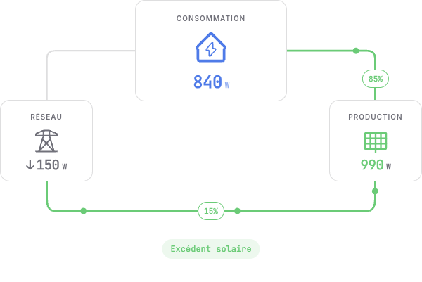
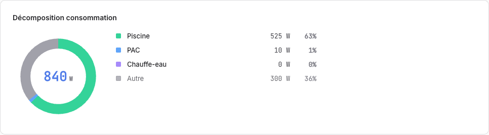
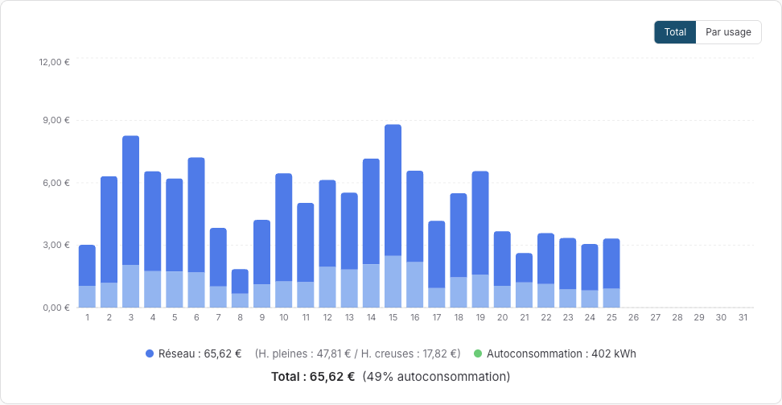
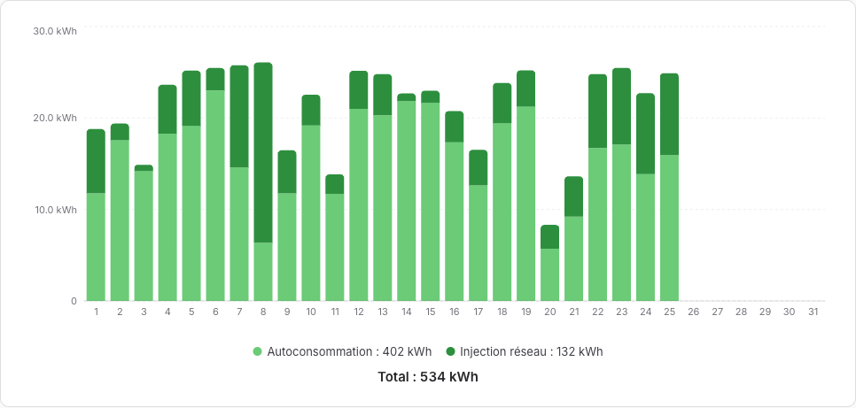
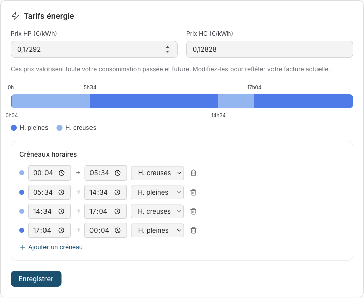

# Où va l'énergie

_Une maison avec des panneaux solaires se pose trois questions toute la journée : qu'est-ce que je produis, qu'est-ce que je consomme, et combien ça coûte ? Sowel répond aux trois sur un même écran, à partir des compteurs que vous avez déjà. Visite guidée._

---

## Partie 1 : Les trois réponses

### Maintenant : la page Live

La page Live est l'instantané. Trois chiffres et deux flux : ce que la maison tire, ce que les panneaux produisent, et ce qui traverse le compteur dans quel sens. Quand les panneaux couvrent la maison, la page le dit en une phrase : excédent solaire.

En dessous, la décomposition de la consommation dit où partent les watts, en direct, par charge mesurée. Une pompe de piscine qui filtre à 525 W représente 63 % de la maison à cet instant ; le reste, c'est le frigo, la box, la vie de la maison, regroupés sous Autre.

Une charge dont la prise n'a rien envoyé depuis plus de deux minutes affiche **mesure ancienne**, sans chiffre ni pourcentage, plutôt que la dernière valeur reçue. Ce détail compte plus qu'il n'en a l'air : un `0 W` périmé ressemble exactement à un appareil éteint, et rien à l'écran ne dirait que le chiffre date d'un quart d'heure. Il compte surtout pendant le surplus, car le total de la maison est alors une petite différence entre deux grands nombres : une mesure oubliée peut l'écraser (issue #744).

### Dans le temps : la page Consommation

Jour, semaine, mois ou année, avec une barre par heure ou par jour. Deux choses font de cette page plus qu'un graphique :

- **Les heures pleines et creuses sont colorées sur les barres.** Vous ne lisez pas une grille horaire ; vous la voyez, barre par barre, exactement comme votre contrat découpe vos journées.
- **Un seul bouton bascule toute la page des kWh aux euros.** Le même mois se lit en énergie ou en argent, avec le partage heures pleines / heures creuses chiffré séparément : un mois à 65,62 € d'électricité réseau, dont 47,81 € en heures pleines, vous en dit plus que 534 kWh.

La vue sait aussi se ventiler **par usage** : chaque charge sous-comptée reçoit sa couleur dans les barres, et la piscine, la PAC et le chauffe-eau portent leur part du mois de façon visible.

### Ce que les panneaux ont fait : la page Production

La page Production coupe chaque barre en deux : ce que la maison a consommé de son propre solaire, et ce qui est parti dans le réseau. L'autoconsommation est la question d'argent d'une installation solaire, et elle a sa réponse par jour, par mois, par année :

Sous le graphique, deux cartes de plus veillent sur l'installation elle-même : la **prévision de production** (ce que les panneaux devraient produire aujourd'hui et demain, et la justesse passée de cette prévision) et la **santé des panneaux** (est-ce que l'installation produit toujours à son niveau habituel, jugé sur les seuls jours clairs). Chacune mérite sa propre histoire : [la prévision et la surveillance](pv-health.md), et [l'arbitre de surplus](surplus-arbiter.md) qui met l'excédent au travail.

### La mise en place : deux déclarations

Tout ce qui précède découle de deux choses que vous déclarez une fois.

**1. Des compteurs, comme équipements.** Sowel est agnostique de l'intégration : n'importe quel plugin qui remonte de la puissance ou de l'énergie sur un device peut alimenter le pipeline. Vous liez vos devices à trois sortes d'équipements :

- un **compteur principal** pour l'échange réseau (un Shelly EM, un lecteur de Linky, tout ce qui voit l'arrivée) ;
- un **compteur de production** côté solaire ;
- des **sous-compteurs** pour les charges que vous voulez suivre individuellement. Une simple pince qui ne remonte que des watts suffit : Sowel intègre le signal de puissance en énergie localement, et l'état survit aux redémarrages.

**2. Votre tarif.** Dans Réglages, Énergie : vos créneaux d'heures pleines et creuses, dessinés sur une frise de 24 h, et les deux prix. Cette seule déclaration colore les barres de consommation, chiffre la vue en euros, et alimente chaque montant affiché dans l'application.

---

## Partie 2 : Sous le capot, en bref

Cet article reste volontairement léger ; le détail vit dans le [guide du suivi énergétique](../user/energy.md) et dans les deux articles de fond compagnons. Quatre faits méritent quand même d'être connus :

- **Tout est local.** L'historique vit dans une InfluxDB embarquée dans le déploiement Docker de Sowel : données brutes 7 jours, agrégats horaires 2 ans, agrégats quotidiens 10 ans, sous-échantillonnés automatiquement. Pas de compte cloud, aucune donnée ne quitte la maison.
- **Le partage d'autoconsommation est calculé au compteur, minute par minute.** L'autoconsommé, c'est la production moins l'injection, borné pour que la dérive entre deux compteurs n'invente jamais d'énergie.
- **Les frontières de journée sont votre minuit.** Les agrégats respectent le fuseau local, donc la barre étiquetée mardi contient mardi.
- **Le classifieur tarifaire suit vos créneaux déclarés**, y compris ceux qui traversent minuit, et les totaux heures pleines / heures creuses affichés sous le graphique sortent de la même classification qui colore les barres. Ce qui est chiffré est ce qui a été mesuré.

Pour aller plus loin : [L'arbitre de surplus](surplus-arbiter.md) explique comment l'excédent que vous voyez sur la page Live se partage entre vos charges pilotables. [Veiller sur les panneaux](pv-health.md) explique comment la prévision apprend votre installation et comment une panne silencieuse se fait attraper.
