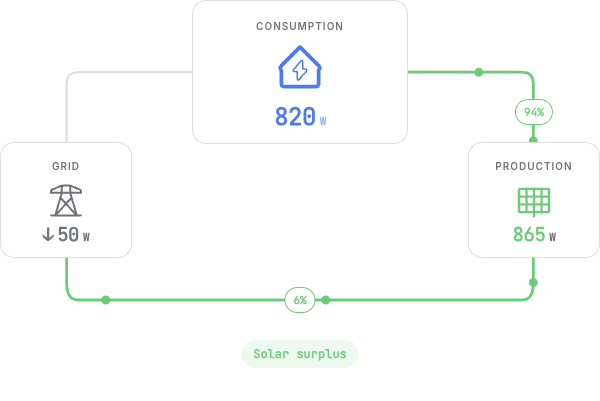
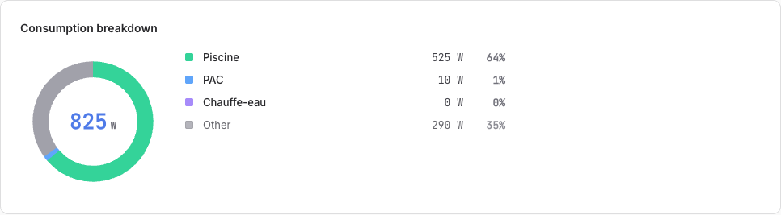
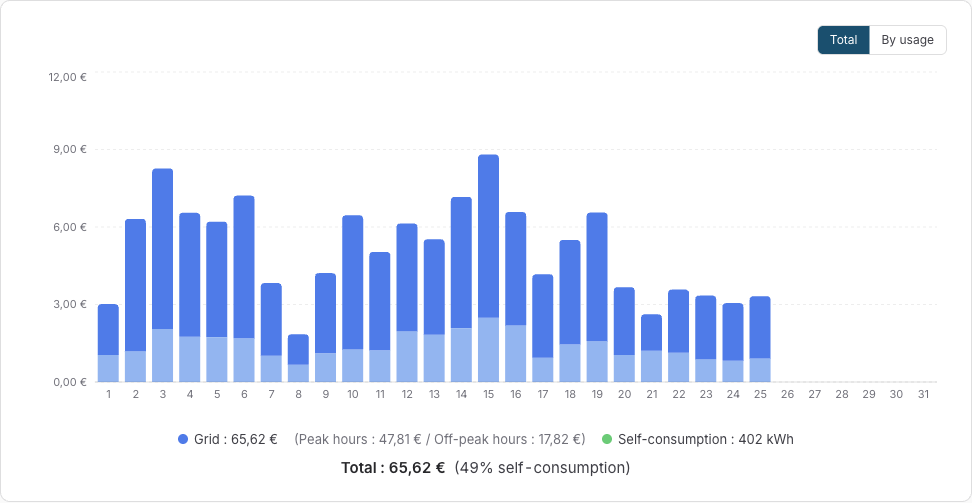
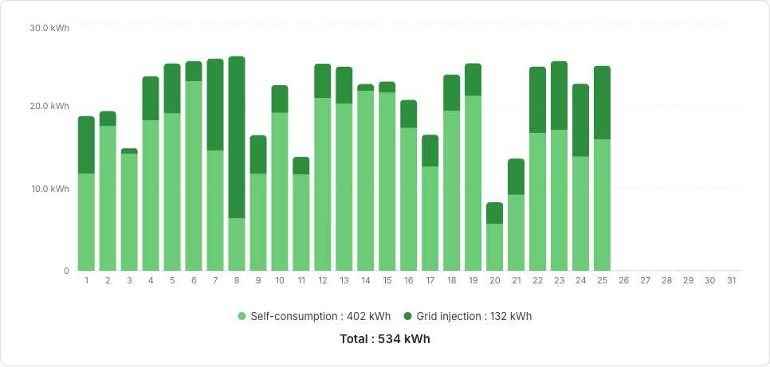
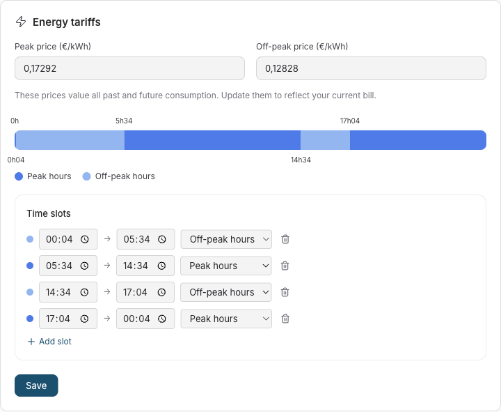

# Where the energy goes

_A house with solar panels asks three questions all day long: what am I producing, what am I consuming, and what does it cost? Sowel answers all three on one screen, from any meter you already own. This is the tour._

---

## Part 1: The three answers

### Right now: the Live page

The Live page is the instant picture. Three figures and two flows: what the house draws, what the panels produce, and what crosses the meter in which direction. When the panels cover the house, the page says so in one phrase: solar surplus.

Below it, the consumption breakdown says where the watts are going, live, per metered load. A pool pump filtering at 525 W is 64 % of the house at that instant; the rest is the fridge, the router, the life of the house, grouped under Other.

### Over time: the Consumption page

Day, week, month or year, with one bar per hour or per day. Two things make this page more than a chart:

- **Peak and off-peak hours are colored on the bars.** You do not read a schedule; you see it, bar by bar, exactly as your contract slices your days.
- **One toggle switches the whole page from kWh to euros.** The same month reads either as energy or as money, with the peak and off-peak split priced separately: a month at 65,62 € of grid electricity, of which 47,81 € at peak rate, tells you more than 534 kWh ever will.

The view can also split **by usage**: each submetered load gets its own color in the bars, so the pool, the heat pump and the water heater carry their share of the month visibly.

### What the panels did: the Production page

The Production page splits every bar in two: what the house consumed of its own solar power, and what was injected into the grid. Self-consumption is the money question of a solar installation, and it is answered per day, per month, per year:

Below the chart, two more cards watch the installation itself: the **production forecast** (what the panels should produce today and tomorrow, and how accurate the forecast has been) and **panel health** (whether the installation still performs at its usual level, judged on clear days only). Both deserve their own story: [the forecast and health monitoring](pv-health.md), and [the surplus arbiter](surplus-arbiter.md) that puts the surplus to work.

### Setting it up: two declarations

Everything above comes from two things you declare once.

**1. Meters, as equipments.** Sowel is integration agnostic: any plugin that reports power or energy on a device can feed the pipeline. You bind your devices to three kinds of equipment:

- a **main meter** for the grid exchange (a Shelly EM, a Linky reader, anything that sees the mains);
- a **production meter** on the solar side;
- **submeters** for the loads you want to follow individually. A cheap clamp that only reports watts is enough: Sowel integrates the power signal into an energy stream locally, and the state survives restarts.

**2. Your tariff.** In Settings, Energy: your peak and off-peak time slots, drawn on a 24 h timeline, and the two prices. That single declaration colors the consumption bars, prices the euro view, and feeds every cost figure in the app.

---

## Part 2: Under the hood, briefly

This article stays light on purpose; the details live in the [energy monitoring guide](../user/energy.md) and in the two companion deep dives. Four facts are worth knowing anyway:

- **Everything is local.** History lives in an InfluxDB that ships inside Sowel's own Docker deployment: raw data for 7 days, hourly aggregates for 2 years, daily aggregates for 10 years, downsampled automatically. No cloud account, no data leaving the house.
- **The self-consumption split is computed at the meter, minute by minute.** Self-consumed power is what the panels produced minus what was injected, clamped so that meter drift between two devices never invents energy.
- **Day boundaries are your midnight.** Aggregates respect the local timezone, so the bar labeled Tuesday contains Tuesday.
- **The tariff classifier follows your declared slots**, including slots that cross midnight, and the peak and off-peak totals shown under the chart are computed from the same classification that colors the bars. What you see priced is what was measured.

Where to go next: [The surplus arbiter](surplus-arbiter.md) explains how the surplus you see on the Live page gets shared between your flexible loads. [Watching over the panels](pv-health.md) explains how the forecast learns your installation and how a silent fault gets caught.
