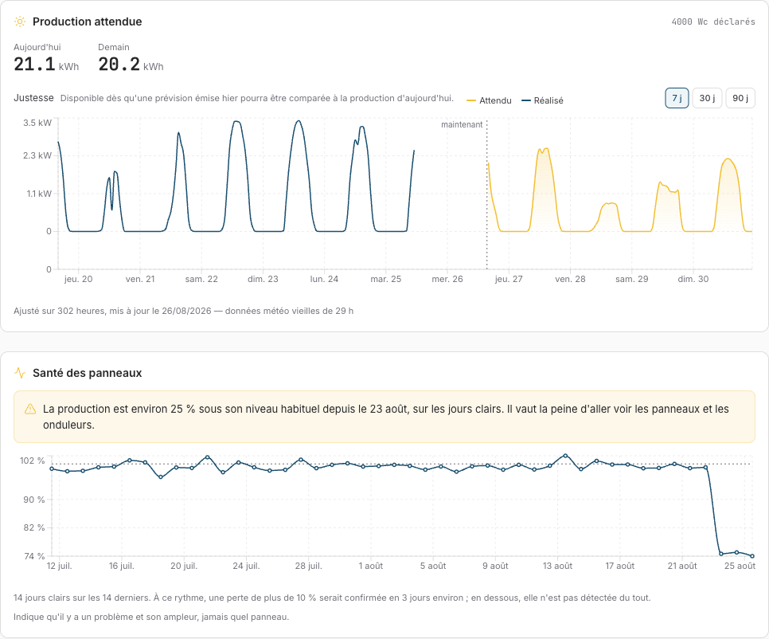
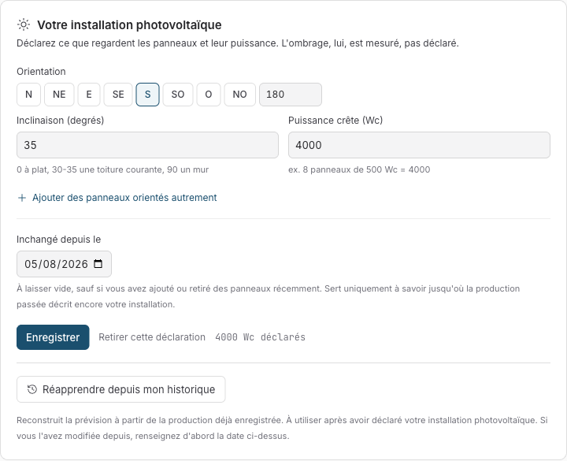

# Veiller sur les panneaux

_Une installation solaire tombe en panne en silence : un panneau perdu ressemble exactement à un mois nuageux. Comment Sowel a appris à faire la différence — validé sur une vraie panne de huit mois que sa propre installation de référence avait vécue._

---

## Partie 1 — Ce que ça vous apporte

### Le problème que ça résout

Les panneaux solaires n'annoncent pas leurs pannes — et dans une installation moderne, ce ne sont d'ailleurs presque jamais les panneaux eux-mêmes qui meurent en premier. C'est l'électronique vissée derrière : une voie de micro-onduleur, un optimiseur, un connecteur oxydé, une diode de bypass. Une voie devient muette et la production d'un panneau disparaît — un huitième sur un toit de huit panneaux, moins que la différence entre une belle journée et une journée voilée. L'installation de référence sur laquelle cette fonctionnalité a été construite a **perdu une voie de son micro-onduleur — un panneau sur six, muet — pendant huit mois** avant que quiconque s'en aperçoive. Huit mois à payer de l'électricité que le toit aurait dû produire.

L'instrument habituel du foyer — le graphique de production — ne peut pas attraper ça. La production varie d'un facteur cinq entre un jour clair et un jour couvert ; un défaut de 12 % se cache confortablement dans ce bruit. Il faut comparer ce que les panneaux ont produit à ce que _le ciel leur offrait_, et seulement les jours où cette offre était propre.

### Ce que Sowel fait

Une fois par jour, Sowel divise l'énergie produite par vos panneaux par la lumière qui les a réellement atteints — sur les **seules heures claires de mi-journée**. Les jours couverts sont entièrement ignorés plutôt que comptés comme de la mauvaise performance : pas d'heures claires, pas de verdict, et la carte le dit. Le score du jour est ensuite comparé à ce dont votre installation s'est récemment montrée _capable_.

Quand le score reste nettement sous cette référence — plus de 10 % en dessous, trois jours clairs d'affilée — Sowel lève une seule alarme, par le même canal que toutes les autres : une notification, une bannière, une ligne dans le fil d'activité. Quand la production revient, l'alarme se résout et le dit.



La capture ci-dessus montre les deux cartes de la page Énergie › Production pendant une panne simulée : la prévision attendu/réalisé en haut, et en dessous la carte de santé — la série de ratios plate autour de 100 % pendant six semaines, puis qui chute à 74 % et y reste. La bannière est apparue au troisième jour clair.

### Ce que ça vous demande : trois champs

Tout ce dont le contrôle a besoin, la prévision de production (v1.57) le collecte déjà. Vous déclarez votre installation une fois — inclinaison, orientation, puissance crête, une entrée par pan de toit — dans Réglages › Énergie. L'ombrage n'est délibérément **jamais** déclaré : le modèle le mesure. Si vous avez de l'historique de production, un clic sur _Réapprendre depuis mon historique_ construit la référence à partir de ce que votre compteur a déjà enregistré.



### Ce que la carte vous dira — et ne vous dira pas

La carte est délibérément honnête sur ses propres limites :

- **Elle nomme l'ampleur d'un défaut, jamais le coupable.** Un panneau mort, une voie de micro-onduleur en panne et un connecteur oxydé laissent la même signature : la production d'un panneau en moins. Dire quel composant — et quel panneau — demanderait de l'électronique par panneau que rien ne déclare.
- **Elle énonce sa vitesse du moment.** La détection a besoin de jours clairs, et les jours clairs arrivent à des rythmes très différents selon la saison. En été la carte peut dire « une perte de plus de 10 % serait confirmée en 3 jours environ » ; en décembre elle admettra être presque aveugle — ce qui est en soi une information qui vaut d'être sue.
- **Tout ce qui est plus léger que 10 % n'est pas signalé du tout.** L'encrassement lent, un onduleur qui dérive de 3 % — sous la marge d'alerte, délibérément, parce qu'alerter dans le bruit météo, c'est crier au loup toutes les semaines.

---

## Partie 2 — Comment ça marche, précisément

_Chaque nombre ci-dessous a été mesuré sur les 16 mois d'historique de l'installation de référence, y compris une vraie panne de huit mois — une voie de micro-onduleur morte — avec date de réparation connue. Historique de la fonctionnalité : specs 160 (prévision), 161 (réapprentissage), 162 (santé) dans l'[index des specs](../specs-index.md)._

### Le ratio quotidien

Pour chaque jour, sur les heures qualifiantes :

```
ratio = production mesurée (Wh) / irradiation dans le plan des panneaux (Wh/m²)
```

Le dénominateur est l'irradiance que le prévisionniste calcule déjà pour chaque heure de jour — projetée sur la géométrie déclarée des panneaux — et **jamais la sortie du modèle ajusté** : diviser par le modèle permettrait à un réajustement d'absorber le défaut même qu'on mesure. Le ratio a des unités (W par W/m²) et sa valeur absolue ne veut rien dire ; seule sa stabilité compte.

Une heure qualifie quand les trois conditions tiennent :

- **10 h-16 h locales** — hors de la bande de mi-journée, la géométrie de soleil bas double le bruit jour-à-jour ;
- **fraction directe de l'irradiance au-dessus de 0,75** — le critère de ciel clair ;
- au moins **4 heures qualifiantes** dans la journée, sans quoi le jour est une opinion, pas une mesure.

Le critère de fraction directe a été mesuré contre l'alternative évidente, la couverture nuageuse : il fait passer le bruit jour-à-jour de 9,5 % à **4,3 %** tout en gardant 39 des 47 jours d'été. Il a aussi la bonne physique : ce qui casse la proportionnalité production/irradiance, c'est la lumière diffuse, et la fraction directe mesure exactement ça.

### La référence : un centile haut, pas une médiane

Le ratio du jour est jugé contre le **80e centile des 180 derniers jours qualifiants** — environ une année civile de jours clairs. Pas une médiane, et ce choix _est_ la fonctionnalité :

Une médiane glissante suit l'installation dans sa chute. Rejouée sur la vraie panne de huit mois, une médiane sur 20 jours couvrait **7 %** des jours de panne : la panne remplit la fenêtre, devient la référence, et le détecteur accepte l'installation cassée comme nouvelle normale. Le 80e centile sur 180 jours couvre **91 %** des mêmes jours de panne au même taux de fausses alertes de 2 %, parce qu'une panne qui remplit un cinquième d'une longue fenêtre ne peut pas déplacer un centile haut. La question à laquelle la référence répond est « de quoi cette installation est-elle capable », pas « qu'a-t-elle fait ces derniers temps » — c'est aussi pourquoi deux semaines de panneaux sales sont _signalées_ comme un déficit plutôt que silencieusement absorbées dans l'étalon.

La référence exige un minimum de **30 jours qualifiants** avant d'affirmer quoi que ce soit ; en dessous, la carte dit qu'elle attend encore.

### L'alerte, et la référence figée

Trois jours qualifiants consécutifs à plus de **10 %** sous la référence lèvent l'alarme. La marge est délibérément au-dessus du plancher de bruit mesuré à 3σ (7,5 % sur trois jours) et en dessous d'un panneau sur huit (12,5 %) — le plus petit défaut qui vaille de réveiller quelqu'un.

Au déclenchement, la référence est **figée** dans l'alerte. Recalculée chaque nuit, elle absorberait lentement le défaut et fermerait l'alerte toute seule au bout de quinze jours, le panneau toujours mort — l'échec de la médiane au ralenti. La résolution est symétrique du déclenchement : trois jours qualifiants revenus au-dessus du seuil figé, pas un seul — un unique jour chanceux fermait une panne limite et la relevait trois jours plus tard, offrant au foyer une paire de notifications par semaine. L'alerte elle-même survit aux redémarrages (persistée avec sa référence figée), se lève exactement une fois, et atteint chaque client — y compris les sessions ouvertes plus tard, qui reconstruisent la bannière depuis un point de reprise.

Un **changement déclaré de l'installation** (vous avez modifié les panneaux et mis la déclaration à jour) remet le jugement à zéro : les jours d'avant le changement décrivent du matériel qui n'existe plus, la référence se reconstruit depuis la date du changement, et toute alerte en cours est fermée comme « suivi réinitialisé » — en ces termes, jamais comme une guérison.

### La validation sur la vraie panne

Tout le pipeline — les fonctions livrées, pas une re-dérivation — a été rejoué sur 16 mois d'historique de l'installation de référence :

| Événement (vérité terrain du propriétaire)                                       | Comportement du détecteur                                                                                           |
| -------------------------------------------------------------------------------- | ------------------------------------------------------------------------------------------------------------------- |
| Une voie du micro-onduleur meurt — un panneau sur six devient muet, automne 2025 | Alerte levée après **2 jours clairs** (13 oct. 2025)                                                                |
| La panne persiste tout l'hiver                                                   | Alerte tenue 8 mois pleins, sans battement                                                                          |
| Voie réparée, fin juin 2026                                                      | Alerte résolue à la réparation (25 juin 2026) ; marche de +23 % mesurée contre +20 % prédit pour un panneau sur six |
| Extension de +1 kWc, déclarée                                                    | Aucune fausse alerte ; référence reconstruite depuis la date déclarée ; +36 % mesuré contre +33 % attendu           |
| Les 8 mois sains autour de ces événements                                        | **Zéro** fausse alerte                                                                                              |

### Où ça se situe face à la littérature

Vérifié après implémentation contre l'état de l'art publié — pvlib/RdTools (NREL), IEC 61724, la détection de ciel clair de Reno-Hansen, et une validation 2026 dans _Solar Energy_ de la détection par règles sur 1 089 installations résidentielles :

- La règle « **N jours clairs consécutifs** sous un seuil relatif » est la même famille que cette étude a validée à l'échelle (classe de précision 92 %) ;
- Une **référence « capable de » en centile haut** rejoint la normalisation au 95e centile de cette étude et les enveloppes de ciel clair du SLAC ; une médiane du réalisé mélange jours dégradés et jours sains — précisément l'échec que le rejeu de la panne a mesuré ;
- Figer la référence au déclenchement est une approximation en ligne reconnue de la détection de rupture ;
- La quasi-cécité hivernale (mesurée ici : **182** jours qualifiants d'avril à septembre contre **50** d'octobre à mars) est reconnue dans la littérature des hautes latitudes mais rarement quantifiée aussi nettement.

Lacunes connues que la littérature comblerait, laissées délibérément à de futures specs : le performance ratio corrigé en température (IEC 61724-1:2021 §14 — la mitigation standard de l'étalement saisonnier), un détecteur CUSUM lent à côté de la règle des 3 jours (les méthodes publiées attrapent en quelques semaines des dérives de 2 à 8 % qui resteront éternellement sous la marge de 10 %), et un discriminant encrassement/panne (la signature de Deceglie : un saut positif abrupt après l'épisode signifie nettoyage, pas réparation).

### La tuyauterie

Les échantillons horaires derrière le ratio vivent 45 jours ; les ratios quotidiens sont gardés **500 jours** — la référence doit survivre aux échantillons, parce que la vraie panne sur laquelle tout ceci a été validé a duré huit mois. Le contrôle tourne une fois par nuit après le réajustement de la prévision, et 30 secondes après chaque démarrage. Le chemin d'alarme et la carte lisent la _même_ série de jours stockée avec le _même_ couperet de changement d'installation : ils ne peuvent jamais être en désaccord sur les jours qui existent.
