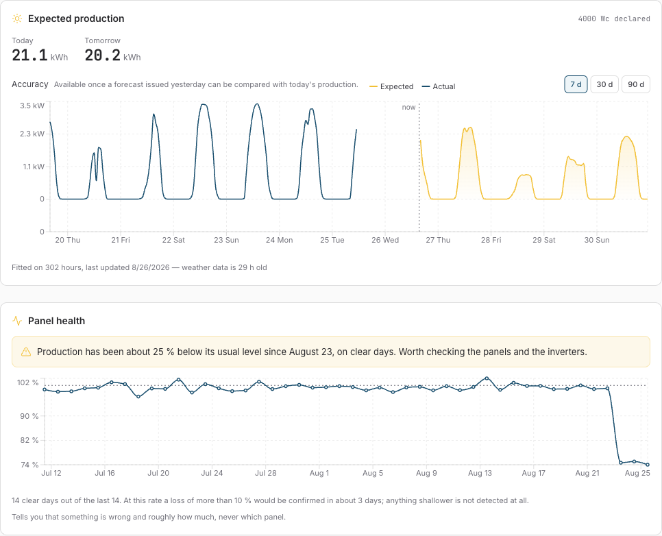
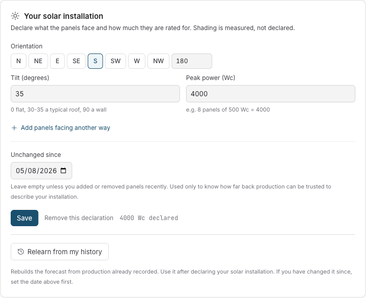

# Watching over the panels

_A solar array fails silently: a lost panel looks exactly like a cloudy month. How Sowel learned to tell the difference, validated against a real eight-month outage its own reference installation had lived through._

---

## Part 1: What it does for you

### The problem it solves

Solar panels don't announce their failures, and in a modern array the panels themselves are rarely what dies first. It is the electronics bolted behind them: a microinverter channel, an optimizer, a corroded connector, a bypass diode. One channel goes silent and one panel's worth of production disappears: an eighth on an eight-panel roof, less than the difference between a nice day and a hazy one. The reference installation this feature was built on **lost one channel of its microinverter, one panel of six silent, for eight months** before anyone noticed. Eight months of paying for electricity the roof should have produced.

The household's usual instrument, the production chart, cannot catch this. Production varies by a factor of five between a clear day and an overcast one; a 12 % fault hides comfortably inside that noise. You need to compare what the panels produced against what _the sky offered them_, and only on days where that offer was clean.

### What Sowel does

Once a day, Sowel divides the energy your panels produced by the sunlight that actually reached them, on **clear middle-of-day hours only**. Overcast days are skipped entirely rather than counted as poor performance: no clear hours, no verdict, and the card says so. The day's score is then compared with what your installation has recently shown itself _capable of_.

When the score stays clearly below that reference (more than 10 % down, three clear days in a row) Sowel raises one alarm, through the same channel as every other alarm: a notification, a banner, a line in the zone activity feed. When production comes back, the alarm resolves and says so.



The screenshot above shows the two cards on the Energy › Production page during a simulated fault: the expected-versus-actual forecast on top, and below it the health card: the ratio series flat around 100 % for six weeks, then dropping to 74 % and staying there. The banner appeared on the third clear day.

### What it asks of you: three fields

Everything the check needs, the forecast feature (v1.57) already collects. You declare your installation once (tilt, orientation, peak power, one entry per roof pitch) in Settings › Energy. Shading is deliberately **never** declared: the model measures it. If you have production history, one click on _Relearn from my history_ builds the reference from what your meter has already recorded.



### What the card will and won't tell you

The card is deliberately honest about its own limits:

- **It names the size of a fault, never the culprit.** A dead panel, a failed microinverter channel and a corroded connector leave the same signature: one panel's worth of production missing. Saying which component, and which panel, would require per-panel electronics nothing declares.
- **It states its current speed.** Detection needs clear days, and clear days arrive at very different rates through the year. In summer the card might say "a loss of more than 10 % would be confirmed in about 3 days"; in December it will admit it is nearly blind, which is itself information worth having.
- **Anything shallower than 10 % is not flagged at all.** Slow soiling, a drifting inverter losing 3 %: below the alert margin, deliberately, because alerting inside the weather noise means crying wolf weekly.

---

## Part 2: How it works, precisely

_Every number below was measured on the reference installation's own 16 months of history, including a real eight-month outage (one microinverter channel down) with a known repair date. Feature history: specs 160 (forecast), 161 (history backfill), 162 (health) in the [specs index](../specs-index.md)._

### The daily ratio

For each day, over hours that qualify:

```
ratio = measured production (Wh) / plane-of-array irradiation (Wh/m²)
```

The denominator is the irradiance the forecaster already computes for every daylight hour, projected onto the declared panel geometry, and **never the fitted model's output**: dividing by the model would let a model refit absorb the very fault being measured. The ratio has units (W per W/m²) and its absolute value is meaningless; only its stability matters.

An hour qualifies when all three hold:

- **10:00-16:00 local**: outside the midday band, low-sun geometry doubles the day-to-day noise;
- **direct (beam) fraction of irradiance above 0.75**: the clear-sky criterion;
- at least **4 such hours** in the day, or the day is an opinion, not a measurement.

The direct-fraction criterion was measured against the obvious alternative, a cloud-cover proxy: it cut day-to-day noise from 9.5 % to **4.3 %** while keeping 39 of 47 summer days. It also has the right physics: what breaks the production/irradiance proportionality is diffuse light, and beam fraction measures exactly that.

### The reference: a high centile, not a median

The day's ratio is judged against the **80th centile of the trailing 180 qualifying days**, roughly a calendar year of clear days. Not a median, and this choice _is_ the feature:

A rolling median follows the array down. Replayed against the real eight-month outage, a 20-day median covered **7 %** of the fault days: the fault fills the window, becomes the reference, and the detector accepts the broken array as the new normal. The 80th centile of 180 days covered **91 %** of the same fault days at the same 2 % false-alert rate, because a fault filling a fifth of a long window cannot move a high centile. The question the reference answers is "what is this array capable of", not "what has it typically done lately". That is also why two dirty weeks are _reported_ as a deficit rather than silently absorbed into the standard.

The reference needs a minimum of **30 qualifying days** before anything is asserted; below that the card says it is still waiting.

### Alerting, and the frozen reference

Three consecutive qualifying days more than **10 %** below the reference raise the alarm. The margin is deliberately above the measured 3σ noise floor (7.5 % over three days) and below one panel of eight (12.5 %): the smallest fault worth waking someone for.

At the raise, the reference is **frozen** into the standing alert. Recomputed nightly, it would slowly absorb the fault and clear the alert on its own after a fortnight with the panel still dead: the median failure in slow motion. Resolution is symmetric with the raise: three qualifying days back above the frozen threshold, not one. A single lucky day used to clear a marginal fault and re-raise it three days later, giving the household a notification pair every week. The alert itself survives restarts (persisted with its frozen reference), raises exactly once, and reaches every client, including sessions opened later, which rebuild the banner from a snapshot endpoint.

A **declared capacity change** (you changed the panels and updated the declaration) resets the judgement: days from before the change describe hardware that is gone, so the reference is rebuilt from the change date, and any standing alert is closed as "monitoring reset", in those words, never as a recovery.

### Validation on the real outage

The entire pipeline (the shipped functions, not a re-derivation) was replayed over 16 months of the reference installation's history:

| Event (ground truth from the owner)                                      | Detector behaviour                                                                                      |
| ------------------------------------------------------------------------ | ------------------------------------------------------------------------------------------------------- |
| A microinverter channel fails, one panel of six goes silent, autumn 2025 | Alert raised after **2 clear days** (13 Oct 2025)                                                       |
| Fault persists through winter                                            | Alert held for the full 8 months, no flapping                                                           |
| The channel repaired, late June 2026                                     | Alert resolved on the repair (25 Jun 2026); measured +23 % step vs +20 % predicted for one panel of six |
| +1 kWc extension added, declared                                         | No false alert; reference rebuilt from the declared date; measured +36 % vs +33 % expected              |
| The 8 healthy months around these events                                 | **Zero** false alerts                                                                                   |

### Where this stands against the literature

Checked after implementation against the published state of the art: pvlib/RdTools (NREL), IEC 61724, Reno-Hansen clear-sky detection, and a 2026 _Solar Energy_ validation of rule-based fault detection on 1 089 residential systems:

- The "**N consecutive clear days** below a relative threshold" rule is the same family that study validated at scale (92 % precision class);
- A **high-centile "capable of" reference** matches that study's 95th-centile normalisation and SLAC's clear-sky-envelope baselines; a median of realised output mixes degraded and healthy days, precisely the failure the outage replay measured;
- Freezing the reference at the raise is a recognised online approximation of change-point detection;
- The winter near-blindness (measured here: **182** qualifying days April-September against **50** October-March) is acknowledged in the high-latitude literature but rarely quantified this sharply.

Known gaps the literature would close, deliberately left for future specs: temperature-corrected performance ratio (IEC 61724-1:2021 §14, the standard mitigation for seasonal spread), a slow CUSUM detector alongside the 3-day rule (published methods catch 2-8 % drifts in weeks; such drifts sit under the 10 % margin forever), and a soiling-versus-fault discriminant (Deceglie's rate-and-recovery signature: an abrupt positive jump after an episode means cleaning, not repair).

### Plumbing

The hourly samples behind the ratio live 45 days; the daily ratios are kept **500 days**: the reference must outlive the samples, because the real fault this was validated on lasted eight months. The check runs once a night after the forecast refit, and 30 seconds after every startup. The alarm path and the card read the _same_ stored day series with the _same_ capacity cutoff, so they can never disagree about which days exist.
