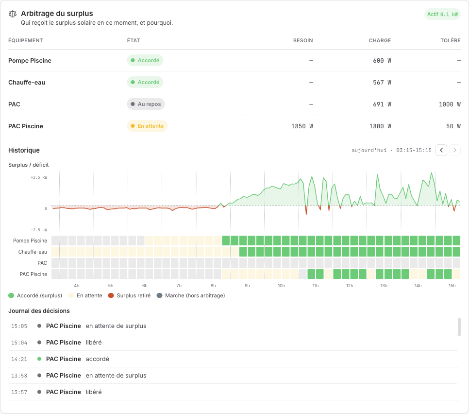
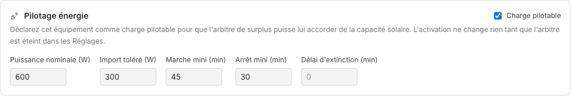
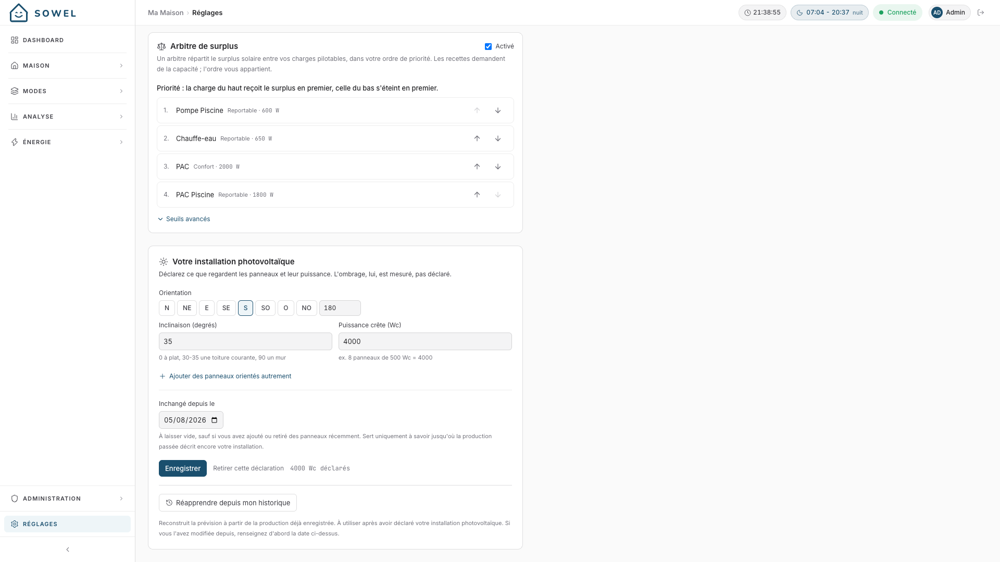

# L'arbitre de surplus

_Comment Sowel décide, toutes les dix secondes, lequel de vos appareils mérite le surplus solaire, et pourquoi un seul arbitre vaut mieux que quatre automatisations astucieuses._

---

## Partie 1 : Ce que ça vous apporte

### Le problème qu'il résout

Une maison avec des panneaux solaires et quelques grosses charges pilotables (une pompe de piscine, un chauffe-eau, une ou deux pompes à chaleur) se pose la même question toute la journée : **il y a du courant solaire en trop en ce moment ; qui doit en profiter ?**

La réponse naïve consiste à donner à chaque appareil sa propre automatisation « marche sur solaire ». Elle échoue d'une manière prévisible : chaque automatisation voit le _même_ surplus et le revendique en même temps. Trois charges s'allument pour 800 W disponibles, la maison se met à importer, les trois automatisations voient l'import et s'éteignent, le surplus réapparaît, et le cycle recommence. Chaque automatisation a raison localement, et la maison a tort globalement.

La réponse de Sowel est un arbitre unique : l'**arbitre de surplus**. Les automatisations n'allument plus rien « parce que solaire » : elles _demandent de la capacité_. L'arbitre connaît le seul vrai surplus, votre ordre de priorité, et ce que chaque charge consomme réellement, et il accorde ou retire la capacité une décision à la fois. Les recettes demandent ; **l'ordre vous appartient**.

### Ce que vous voyez

La page Énergie › Live répond d'un coup d'œil à « qui reçoit le surplus en ce moment, et pourquoi » :



Trois étages, de haut en bas :

- **La table d'état** : chaque charge pilotable avec son état du moment (_Accordé_, _Accordé (ne consomme pas)_, _En attente_, _Au repos_), ce qu'elle a demandé, ce qu'elle consomme réellement, et l'import réseau qu'elle est autorisée à tolérer. La table et la frise disent le même mot pour le même état : ce sont deux vues d'une même lecture, pas deux lectures.
- **La frise** : la journée en créneaux de 15 minutes par charge, face à la courbe de surplus/déficit. On y voit la pompe de piscine prendre le surplus du matin, le chauffe-eau la rejoindre à midi, la PAC de piscine attendre son tour. Le vert plein dit que la charge a bien consommé le surplus qu'on lui a accordé ; un vert plus clair dit qu'elle l'avait, et que sa mesure de puissance ne montre rien — un chauffe-eau dont le disjoncteur est resté ouvert, une pompe qui n'a jamais démarré. Une charge sans mesure de puissance reste en vert plein : Sowel n'affiche pas une information qu'il n'a pas.
- **Le journal des décisions** : chaque octroi et chaque retrait, horodatés, en toutes lettres. Quand vous vous demandez « pourquoi la PAC s'est arrêtée à 15 h 04 », la réponse y est écrite.

### Ce que vous configurez

Trois points de contact, par ordre croissant de « vous n'en aurez probablement jamais besoin » :

**1. Déclarer une charge pilotable.** Sur la fiche de l'équipement, cochez _Charge pilotable_ et donnez la puissance nominale. C'est tout le ticket d'entrée :



**2. Ordonner vos priorités.** Dans Réglages › Énergie, classez vos charges dans l'ordre qui correspond à votre vie. La charge du haut reçoit le surplus en premier ; celle du bas s'éteint en premier. Cette liste est la décision la plus importante que vous prenez, et elle est à vous, pas à un algorithme :



**3. Les seuils avancés.** Sept molettes avec des valeurs par défaut raisonnables, expliquées en partie 2. La plupart des installations n'y touchent jamais.

### Les comportements que vous avez gratuitement

- **Votre main gagne toujours.** Allumez ou éteignez une charge à la main : l'arbitre s'efface pour cette charge pendant deux heures, puis reprend discrètement. Il ne se bat jamais contre vous.
- **Pas de cycles courts.** Une charge accordée tourne une durée minimale avant de pouvoir être retirée, et se repose une durée minimale avant d'être ré-accordée. Les compresseurs et les garnitures de pompe coûtent cher ; les faire clignoter pour courir après les nuages n'est pas de l'optimisation.
- **La puissance réelle, pas la puissance déclarée.** L'arbitre apprend ce que chaque charge consomme vraiment au fil de ses marches et budgète avec la mesure : une pompe déclarée à 600 W qui tire en réalité 650 W ne pousse pas silencieusement la maison vers l'import.
- **Il échoue du bon côté.** Si le compteur devient muet, l'arbitre cesse d'accorder. Si l'état réel d'une charge contredit sa décision, parce que quelqu'un a utilisé l'interrupteur mural, il se retire plutôt que de se battre contre le mur.

---

## Partie 2 : Comment ça marche, précisément

_Cette section documente l'algorithme réel et chaque réglage, avec les décisions de conception et leurs raisons. Historique de la fonctionnalité : specs 140 (arbitre), 148 (frise), 158 (métriques de référence) dans l'[index des specs](../specs-index.md)._

### Architecture

Un seul `CapacityArbiter` tourne dans le moteur Sowel. Les recettes et les automatisations d'équipement ne commandent jamais « allume parce que solaire » ; elles soumettent une **demande de capacité** (charge, watts souhaités). L'arbitre possède toute la boucle décision-action :

```
compteur ──► surplus lissé ──► boucle de décision ──► octroi / retrait ──► ordres
                                      ▲
   demandes (recettes, profils) ──────┘
```

Les décisions sont des événements sur le bus du moteur, persistées dans la frise, poussées à l'UI par WebSocket, et journalisées. La carte Live est un pur modèle de lecture : tout ce qu'elle montre est ce que l'arbitre a réellement fait, pas une estimation parallèle.

### Ce que « surplus » veut dire : un seul nombre, mesuré

Le surplus de l'arbitre est **l'échange réseau signé mesuré au compteur principal** : positif en export, négatif en import. Ce n'est délibérément _pas_ « production moins consommation » calculée depuis des compteurs séparés (deux compteurs dérivent ; l'écrêtage à la minute fait mentir leur différence), et le surplus affiché partout dans Sowel (la pastille, la courbe, l'API des recettes) est ce même nombre mesuré. La comptabilité interne des réservations (la part du surplus déjà promise aux charges accordées) existe mais n'est jamais affichée comme « surplus » : montrer le résidu faisait contredire la pastille par le compteur sur le mur, et c'est le compteur qui gagne.

### La boucle de décision

À chaque tour, l'arbitre :

1. **Lisse** le surplus sur une fenêtre glissante (_Lissage compteur_, 60 s par défaut). Un compteur domestique brut fluctue de centaines de watts ; accorder sur un frémissement, c'est retirer au suivant.
2. **Accorde** la charge en attente la plus prioritaire si le surplus lissé est resté au-dessus du _besoin effectif_ de la charge plus la _marge d'octroi_ (100 W par défaut) pendant la _tenue avant octroi_ (120 s par défaut). Le besoin effectif a trois niveaux : la consommation instantanée fraîche quand la charge tourne, sinon la puissance **apprise** mesurée sur les marches passées, sinon la puissance nominale déclarée.
3. **Retire** la charge accordée la moins prioritaire si le déficit a dépassé l'_import toléré_ de la charge pendant la _tenue avant retrait_ (600 s par défaut). L'asymétrie est voulue : arriver tard ne coûte rien, partir tôt coûte un démarrage de compresseur.
4. **Protège** chaque charge accordée par sa _marche mini_ et chaque charge au repos par son _arrêt mini_ : des planchers anti-cycles-courts qui priment sur l'arithmétique du surplus. Un nuage plus court que la tenue de retrait plus la marche mini n'atteint tout simplement jamais le matériel.

La priorité est stricte et vôtre : la liste des Réglages, le haut d'abord pour les octrois, le bas d'abord pour les délestages. Deux classes de charge précisent ce qu'un octroi veut dire : une charge **reportable** (pompe de piscine, chauffe-eau) est allumée et éteinte franchement ; une charge **confort** (une PAC qui tourne déjà pour le foyer) n'est jamais éteinte par l'arbitre : un octroi ne fait que la _booster_, et un retrait la ramène à sa consigne normale.

### Chaque réglage, documenté

**Par charge** (fiche équipement › Pilotage énergie) :

| Réglage                  | Défaut | Ce qu'il fait                                                                                                                                                                                                                                    |
| ------------------------ | ------ | ------------------------------------------------------------------------------------------------------------------------------------------------------------------------------------------------------------------------------------------------ |
| Charge pilotable         | off    | Enrôle l'équipement. L'activer ne change rien tant que l'arbitre lui-même est éteint.                                                                                                                                                            |
| Puissance nominale (W)   | aucune | Le budget utilisé tant qu'il n'y a pas assez de marches pour apprendre la consommation réelle. Obligatoire.                                                                                                                                      |
| Import toléré (W)        | 0      | L'import réseau que cette charge peut encaisser avant que l'horloge du déficit démarre. Non nul pour les charges dont le cycle plonge (compresseurs de PAC) ou qui doivent finir ce qu'elles ont commencé (une pompe de piscine et sa lampe UV). |
| Marche mini (min)        | 0      | Une fois accordée, la charge tourne au moins cette durée. Plancher anti-cycles-courts ; c'est aussi la molette qui garantit une marche utile minimale (une pompe qui doit filtrer 45 min pour valoir son démarrage).                             |
| Arrêt mini (min)         | 0      | Une fois retirée, la charge se repose au moins cette durée avant le prochain octroi.                                                                                                                                                             |
| Délai d'extinction (min) | global | Le temps que la charge met à réellement s'arrêter après un retrait, par exemple la tempo de 30 minutes d'un chauffe-eau thermodynamique. L'arbitre continue de budgéter cette puissance au lieu de l'allouer deux fois.                          |

**Globaux** (Réglages › Énergie › Arbitre de surplus › Seuils avancés) :

| Réglage                       | Défaut | Ce qu'il fait                                                                                                                                     |
| ----------------------------- | ------ | ------------------------------------------------------------------------------------------------------------------------------------------------- |
| Marge d'octroi (W)            | 100    | Réserve de sécurité gardée avant d'accorder davantage. Plus haut = octrois plus tardifs, moins d'import.                                          |
| Tenue avant octroi (s)        | 120    | Durée pendant laquelle le surplus doit persister avant un octroi. Plus haut = les pics brefs de soleil sont ignorés.                              |
| Tenue avant retrait (s)       | 600    | Durée pendant laquelle le déficit doit persister avant un retrait. Plus haut = moins de cycles marche/arrêt.                                      |
| Lissage compteur (s)          | 60     | Fenêtre de moyennage sur la mesure du compteur. Plus haut = moins de bruit, réaction plus lente.                                                  |
| Suspension manuelle (s)       | 7200   | Durée pendant laquelle une action manuelle met l'arbitre en pause pour cette charge avant reprise automatique.                                    |
| Compteur muet après (s)       | 300    | Si le compteur n'envoie rien pendant cette durée, la donnée est jugée périmée et les octrois cessent. Garde-fou : pas de donnée, pas de promesse. |
| Confirmation interrupteur (s) | 60     | Durée pendant laquelle l'état réel d'une charge doit contredire la décision de l'arbitre avant qu'il s'efface. Le détecteur d'interrupteur mural. |

### Les pannes et leurs réponses

- **Compteur silencieux** → _compteur muet après_ stoppe tout octroi ; les charges accordées gardent leur état plutôt que d'être révoquées à l'aveugle.
- **Une main sur l'interrupteur mural** → _confirmation interrupteur_ détecte la divergence durable entre décision et réalité et suspend l'arbitrage pour cette charge ; le journal le dit.
- **La charge qui ment sur sa puissance** → la puissance apprise remplace la déclaration après quelques marches (la carte du profil affiche « Mesuré : N W sur K marches »).
- **La bande de flottement de 15 h**, un surplus qui oscille pile autour du besoin d'une charge, est amortie trois fois : le lissage aplatit le bruit, les tenues exigent de la persistance, marche mini et arrêt mini planchent la durée des cycles.

### Ce qu'il ne fait délibérément pas

Pas d'optimisation tarifaire, pas de prévision dans la boucle, pas de priorités apprises par machine. L'arbitre est un _arbitre_, pas un trader : il rend vrai l'ordre que le foyer a déclaré, face au surplus mesuré, et chacune de ses décisions se relit en une ligne de journal. La planification prédictive par-dessus (préchauffer avant un après-midi couvert, différer selon le tarif) est une feuille de route séparée et mesurée, avec le journal de décisions de cet arbitre comme référence de départ.
