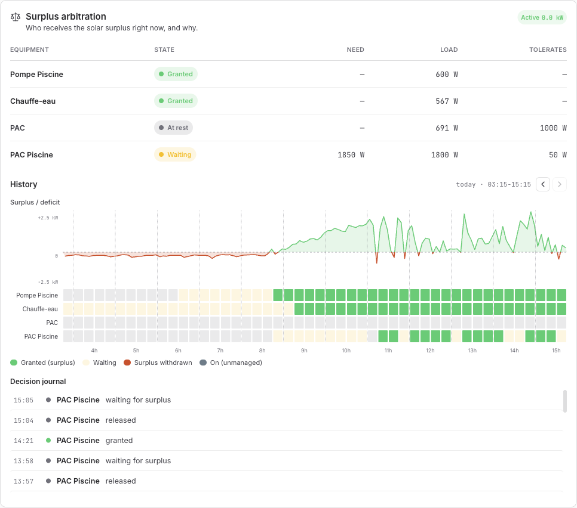
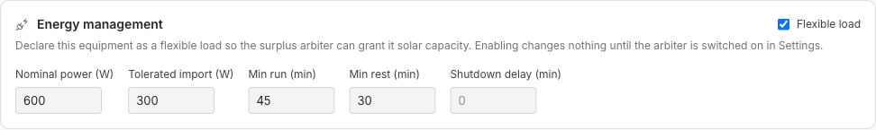
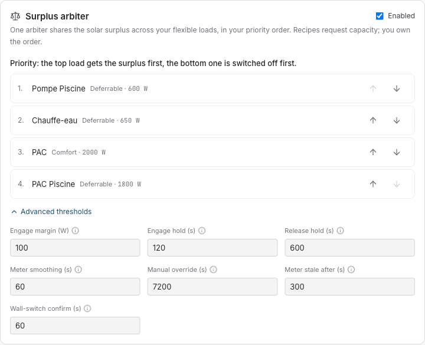

# The surplus arbiter

_How Sowel decides, every ten seconds, which of your appliances deserves the solar surplus, and why one referee beats four clever automations._

---

## Part 1: What it does for you

### The problem it solves

A house with solar panels and a few big flexible loads (a pool pump, a water heater, one or two heat pumps) faces the same question all day long: **there is spare solar power right now; who should get it?**

The naive answer is to give each appliance its own "run on solar" automation. It fails in a predictable way: every automation sees the _same_ surplus and claims it at the same time. Three loads switch on for 800 W of spare power, the house starts importing, all three automations see the import and switch off, the surplus reappears, and the cycle starts again. Each automation is locally right and the house is globally wrong.

Sowel's answer is a single referee: the **surplus arbiter**. Automations don't switch loads on solar anymore: they _ask for capacity_. The arbiter knows the one true surplus, your priority order, and what every load actually draws, and it grants or revokes capacity one decision at a time. Recipes request; **you own the order**.

### What you see

The Energy › Live page answers "who has the surplus right now, and why" at a glance:



Three layers, top to bottom:

- **The state table**: each flexible load with its live state (_Granted_, _Waiting_, _Idle_), what it asked for, what it actually draws, and how much grid import it is allowed to tolerate.
- **The timeline**: the day in 15-minute slots per load, against the surplus/deficit curve. You can see the pool pump picking up the morning surplus, the water heater joining at noon, the pool heat pump waiting its turn. The solid green says the load actually consumed the surplus it was granted; a lighter green says it held the grant and its own power measurement shows nothing — a water heater whose breaker was left open, a pump that never started. A load with no power measurement stays solid green: Sowel does not display what it does not know.
- **The decision journal**: every grant and revoke, timestamped, in plain words. When you wonder "why did the heat pump stop at 15:04", the answer is written there.

### What you configure

Three touchpoints, in increasing order of "you will probably never need this":

**1. Declare a flexible load.** On the equipment page, tick _Flexible load_ and give the nominal power. That's the whole entry ticket:



**2. Order your priorities.** In Settings › Energy, drag your loads into the order that matches your life. The top load gets the surplus first; the bottom one is shed first. This list is the single most important decision you make, and it is yours, not an algorithm's:



**3. Advanced thresholds.** Seven knobs with sensible defaults, explained in Part 2. Most installations never touch them.

### The behaviors you get for free

- **Your hand always wins.** Switch a load on or off manually and the arbiter steps aside for that load for two hours, then quietly resumes. It never fights you.
- **No short-cycling.** A granted load runs a minimum duration before it can be revoked, and rests a minimum duration before it can be re-granted. Compressors and pump seals are expensive; ping-ponging them to chase clouds is not optimization.
- **Real power, not declared power.** The arbiter learns what each load actually draws across its runs and budgets with the measured figure, so a pump declared at 600 W that really pulls 650 W doesn't silently push the house into import.
- **It fails safe.** If the grid meter goes silent, the arbiter stops granting. If a load's real state contradicts its decision, because someone used the wall switch, it backs off rather than fighting the wall.

---

## Part 2: How it works, precisely

_This section documents the actual algorithm and every setting, with the design decisions and their reasons. Feature history: specs 140 (core arbiter), 148 (timeline), 158 (baseline metrics) in the [specs index](../specs-index.md)._

### Architecture

One `CapacityArbiter` runs in the Sowel engine. Recipes and equipment-level automations never command "on because solar" directly; they submit a **capacity request** (load, wanted watts). The arbiter owns the whole decide-act loop:

```
grid meter ──► smoothed surplus ──► decision loop ──► grant / revoke ──► orders
                                        ▲
   requests (recipes, profiles) ────────┘
```

Decisions are events on the engine bus, persisted to the timeline store, pushed to the UI over WebSocket, and journaled. The Live card is a pure read model: everything it shows is what the arbiter actually did, not a parallel estimate.

### What "surplus" means: one number, measured

The arbiter's surplus is the **signed grid exchange measured at the main meter**: positive when exporting, negative when importing. It is deliberately _not_ "production minus consumption" computed from separate meters (two meters drift; per-minute clamping makes their difference lie), and the user-facing surplus everywhere in Sowel (the pill, the curve, the recipe API) is this same measured number. Internal reservation accounting (how much of the surplus is already promised to granted loads) exists but is never displayed as "surplus": showing the residual made the pill contradict the meter on the wall, and the meter wins.

### The decision loop

Every meter tick, the arbiter:

1. **Smooths** the surplus over a sliding window (_Meter smoothing_, default 60 s). Raw home meters flicker by hundreds of watts; granting on a flicker means revoking on the next one.
2. **Grants** the highest-priority waiting load if the smoothed surplus has stayed above the load's _effective need_ plus the _engage margin_ (default 100 W) for the _engage hold_ (default 120 s). Effective need is three-tier: the load's fresh live draw when it is running, else the **learned** power the arbiter has measured across past runs, else the declared nominal power.
3. **Revokes** the lowest-priority granted load if the deficit has persisted beyond the load's _tolerated import_ for the _release hold_ (default 600 s). The asymmetry is intentional: joining late is cheap, quitting early costs a compressor start.
4. **Shields** every granted load by its _min run_ and every idle load by its _min rest_: anti-short-cycle floors that outrank the surplus arithmetic. A cloud that lasts less than the release hold plus the min-run shield simply never reaches the hardware.

Priority is strict and yours: the list in Settings, top first for grants, bottom first for sheds. Two load classes refine what a grant means: a **deferrable** load (pool pump, water heater) is switched on and off outright; a **comfort** load (a heat pump already running for the household) is never switched off by the arbiter: a grant only _boosts_ it, and a revoke returns it to its normal setpoint.

### Every setting, documented

**Per load** (equipment page › Energy management):

| Setting              | Default | What it does                                                                                                                                                                                                               |
| -------------------- | ------- | -------------------------------------------------------------------------------------------------------------------------------------------------------------------------------------------------------------------------- |
| Flexible load        | off     | Enrolls the equipment. Enabling changes nothing until the arbiter itself is on.                                                                                                                                            |
| Nominal power (W)    | none    | The budget used until enough runs exist to learn the real draw. Required.                                                                                                                                                  |
| Tolerated import (W) | 0       | How much grid import this load may ride through before the deficit clock starts. Non-zero for loads whose duty cycle dips (heat-pump compressors) or that must finish what they started (a pool pump running its UV lamp). |
| Min run (min)        | 0       | Once granted, the load runs at least this long. Anti-short-cycle floor; also the knob that guarantees a minimum useful run (a pool pump that must filter 45 min to be worth starting).                                     |
| Min rest (min)       | 0       | Once revoked, the load rests at least this long before the next grant.                                                                                                                                                     |
| Shutdown delay (min) | global  | How long the load keeps drawing after a revoke before it actually stops, e.g. a thermodynamic water heater's 30-minute tail. The arbiter keeps budgeting that power instead of double-allocating it.                       |

**Global** (Settings › Energy › Surplus arbiter › Advanced thresholds):

| Setting                 | Default | What it does                                                                                                            |
| ----------------------- | ------- | ----------------------------------------------------------------------------------------------------------------------- |
| Engage margin (W)       | 100     | Safety reserve kept before granting more capacity. Higher = later grants, less import.                                  |
| Engage hold (s)         | 120     | How long the surplus must persist before a grant. Higher = brief sun spikes ignored.                                    |
| Release hold (s)        | 600     | How long the deficit must persist before a revoke. Higher = fewer on/off cycles.                                        |
| Meter smoothing (s)     | 60      | Averaging window on the meter reading. Higher = less noise, slower reaction.                                            |
| Manual override (s)     | 7200    | How long a manual action pauses the arbiter for that load before automatic resumption.                                  |
| Meter stale after (s)   | 300     | If the meter stays silent this long, readings are considered stale and granting stops. Fail-safe: no data, no promises. |
| Switch confirmation (s) | 60      | How long a load's real state must contradict the arbiter's decision before it steps aside. The wall-switch detector.    |

### Failure modes and their answers

- **Meter silence** → _stale after_ stops all granting; granted loads keep their state rather than being blind-revoked.
- **A human at the wall switch** → _switch confirmation_ detects sustained divergence between decision and reality and suspends arbitration for that load; the journal says so.
- **The load that lies about its power** → learned power replaces the declaration after a few runs (the profile card shows "Measured: N W over K runs").
- **The 15:00 flapping band**, surplus hovering exactly around one load's need, is damped three times over: smoothing flattens the noise, holds demand persistence, min-run/min-rest floor the cycle length.

### What it deliberately does not do

No price optimization, no forecasting in the loop, no machine-learned priorities. The arbiter is a _referee_, not a trader: it makes the household's stated order true against the measured surplus, and every decision it takes can be read back in one line of the journal. Predictive scheduling on top of it (pre-heating before a cloudy afternoon, tariff-aware deferral) is a separate, measured roadmap, with this arbiter's decision journal as its baseline.
