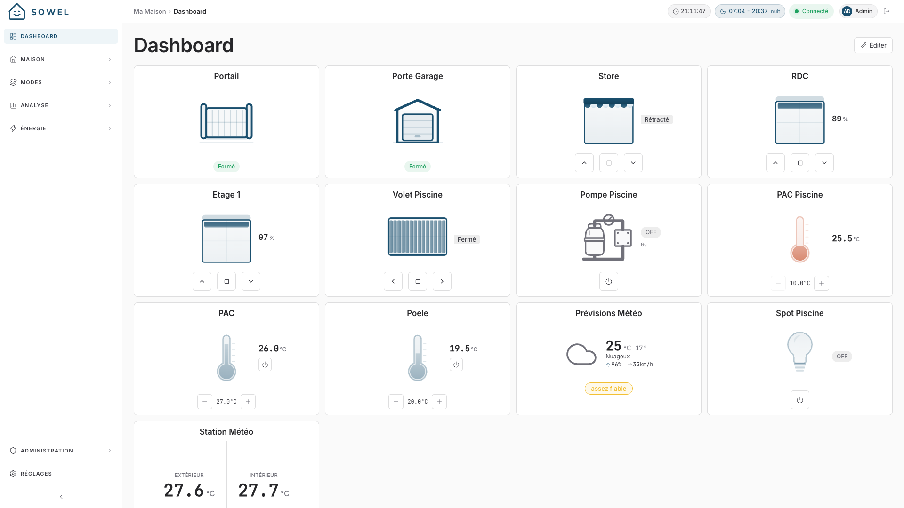
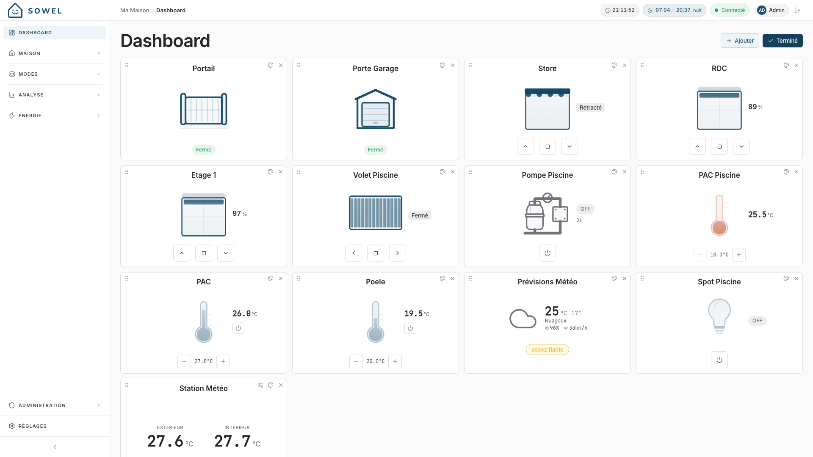

# Tableau de bord

Le Tableau de bord est votre écran d'accueil personnalisé : une grille de widgets configurable qui affiche les informations et les contrôles les plus importants pour vous.

## Vue d'ensemble

Contrairement à la vue Accueil (organisée par zones), le Tableau de bord vous laisse choisir exactement ce que vous voulez voir, peu importe la pièce ou le type d'équipement. Vous pouvez placer les lumières de votre cuisine à côté de la température extérieure et du portail de garage, le tout sur un même écran.

## Types de widgets

### Widget d'équipement

Affiche un équipement unique avec son état courant et ses contrôles rapides.

- **Lumières** : interrupteur, curseur de luminosité (pour les lumières variables)
- **Volets** : affichage de la position avec contrôles ouvrir/fermer
- **Capteurs** : valeurs actuelles avec icônes et unités appropriées
- **Thermostats** : affichage de température avec indicateur de mode
- **Interrupteurs** : badge d'état on/off

Les équipements on/off (lumières, interrupteurs, prises, chauffe-eau, vannes, radiateurs, pompes de piscine, lecteurs multimédia, portails à action unique) changent d'état quand vous cliquez **n'importe où sur la tuile**, et pas seulement sur le bouton sous l'icône. Les tuiles à plusieurs contrôles -- volets, thermostats, volets de piscine, VMC -- gardent leurs boutons. En mode édition la tuile n'agit plus, pour que vous puissiez la déplacer et la renommer sans risque.

La tuile **prévisions météo** affiche demain, et indique à quel point les modèles s'accordent sur cette journée : un point coloré et le mot, à côté de la condition (vert fiable, ambre assez fiable, rouge peu fiable). Cliquez ou touchez la tuile, sur ordinateur comme sur téléphone, pour ouvrir un panneau qui montre les cinq jours de prévision côte à côte, chacun avec sa condition, son maximum, son minimum, son vent et sa fiabilité, ainsi que le modèle d'où vient la prévision.

La fiabilité est publiée par le plugin météo à partir de la version 2.0. Avec un plugin plus ancien, la tuile n'affiche aucune fiabilité et le panneau garde un trait gris sous chaque jour : un jour non qualifié ne doit jamais ressembler à un jour fiable.

### Widget de zone

Affiche les données agrégées d'une zone entière. Vous choisissez quelle **famille** de données afficher :

| Famille       | Ce qui est affiché                                                          |
| ------------- | --------------------------------------------------------------------------- |
| **Lumières**  | Nombre de lumières allumées / total, avec une action rapide "tout éteindre" |
| **Volets**    | Nombre de volets ouverts / total, position moyenne                          |
| **Chauffage** | Température moyenne, statut de chauffage                                    |
| **Capteurs**  | Température, humidité, statut de mouvement                                  |

Les widgets de zone vous donnent une vue d'ensemble rapide d'une pièce sans voir les détails de chaque équipement.

## Ajouter des widgets

1. Entrez en **mode édition** en cliquant sur l'icône crayon en haut à droite du Tableau de bord
2. Cliquez sur le bouton **+** qui apparaît
3. Dans la fenêtre, choisissez entre :
   - **Équipement** : parcourez et sélectionnez n'importe quel équipement
   - **Zone** : sélectionnez une zone et une famille de données

Le widget apparaît à la fin de votre grille.

## Personnaliser les widgets

### Réorganiser

En mode édition, glissez-déposez les widgets pour les réorganiser. L'ordre est enregistré automatiquement.

### Étiquettes et icônes personnalisées

Chaque widget peut avoir une étiquette et une icône personnalisées qui remplacent le nom par défaut de l'équipement ou de la zone. C'est utile pour mettre des noms plus courts sur le tableau de bord.

### Configuration des widgets de capteur

Pour les widgets d'équipements capteurs, vous pouvez choisir quelles liaisons de données afficher. Par défaut, toutes les liaisons sont affichées. Si un capteur remonte température, humidité et pression mais que seule la température vous intéresse, vous pouvez masquer les autres.

### Supprimer des widgets

En mode édition, cliquez sur le bouton de suppression d'un widget pour le retirer du tableau de bord.

## Mode édition

Le mode édition se bascule avec l'icône crayon dans l'en-tête du tableau de bord. Quand il est actif :

- Un bouton **+** apparaît pour ajouter de nouveaux widgets
- Chaque widget affiche un bouton **suppression**
- Les widgets peuvent être **glissés** pour être réordonnés
- Cliquez sur la **coche** pour quitter le mode édition et enregistrer

!!! tip
Le tableau de bord est personnel : chaque utilisateur a sa propre disposition de widgets. Les utilisateurs admin et les utilisateurs réguliers voient leur propre tableau de bord.

## Astuces

- **Restez concentré** : le tableau de bord fonctionne mieux avec 6 à 12 widgets. Trop de widgets réduisent la valeur d'un coup d'œil.
- **Utilisez les widgets de zone pour l'aperçu** : un widget "Capteurs" de zone pour chaque étage vous donne la température de toute la maison en un coup d'œil.
- **Utilisez les widgets d'équipement pour le contrôle** : mettez les lumières et volets que vous utilisez le plus sur le tableau de bord pour un accès en un seul geste.
- **Adapté au mobile** : sur mobile, les widgets s'empilent en une seule colonne. Placez vos widgets les plus importants en haut.
