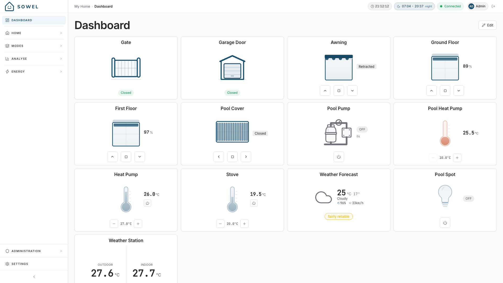
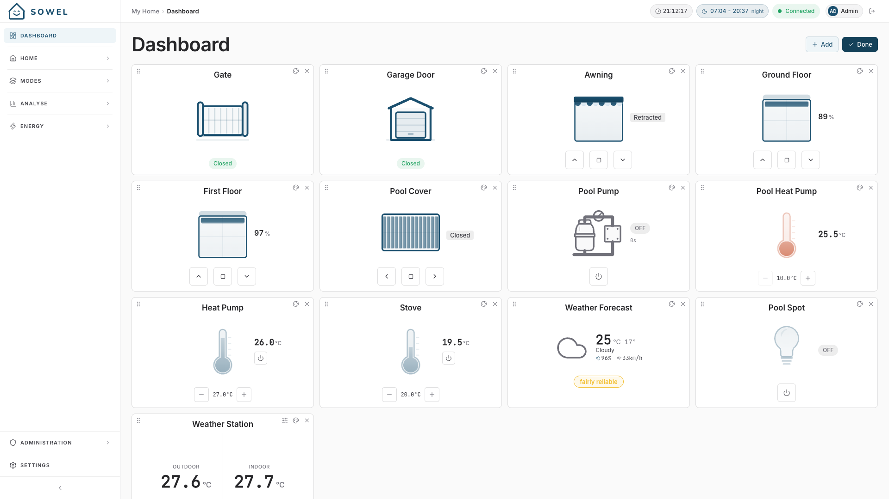

# Dashboard

The Dashboard is your personalized home screen -- a customizable grid of widgets showing the information and controls you care about most.

## Overview

Unlike the Home view (which is organized by zones), the Dashboard lets you pick exactly what you want to see, regardless of room or equipment type. You might put your living room lights next to your outdoor temperature and your garage gate, all on one screen.

## Widget types

### Equipment widget

Displays a single equipment with its current state and quick controls.

- **Lights**: toggle switch, brightness slider (for dimmable lights)
- **Shutters**: position display with open/close controls
- **Sensors**: current values with appropriate icons and units
- **Thermostats**: temperature display with mode indicator
- **Switches**: on/off state badge

On/off equipments (lights, switches, plugs, water heaters, water valves, heaters, pool pumps, media players, single-action gates) toggle when you click **anywhere on the tile**, not just the button under the icon. Tiles with several controls -- shutters, thermostats, pool covers, VMC -- keep their own buttons. In edit mode the tile stops acting, so you can drag and rename it safely.

A tile that shows a **power draw** in watts -- a metering plug, a water heater, a solar panel, an energy meter -- only shows it while the reading is recent. Past that, the figure gives way to a dash and the tile says how old the last reading is, instead of presenting a value the house has no reason to doubt. The budget follows how often the source actually speaks: two minutes for a meter that reports continuously, ten for everything else, because several integrations poll on a five-minute cycle and a healthy appliance must not flicker on every poll. Readings that share a device age together -- a solar tile drops its current and voltage along with the power, and the live measures on an equipment page do the same -- because a silence that hid one figure hid them all. A panel that simply wound down for the night still reads **Standby**, not outdated: it stopped producing, it did not stop being heard from. This is the same rule as the consumption breakdown on the Energy page.

The **weather forecast** tile shows tomorrow, and says how much the models agree on it: a badge at the foot of the tile (green reliable, amber fairly reliable, red unreliable). Click or tap the tile, on a computer as well as on a phone, to open a panel showing the five forecast days side by side, each with its condition, maximum, minimum, wind and a reliability badge, plus the model the forecast came from. It is the same badge as on the equipment page.

Reliability is published by the weather plugin from version 2.0 onwards. With an older plugin the tile shows no reliability at all and the panel shows no badge, because an unqualified day must never look like a reliable one.

### Zone widget

Displays aggregated data for an entire zone. You choose which **family** of data to show:

| Family       | What it shows                                              |
| ------------ | ---------------------------------------------------------- |
| **Lights**   | Number of lights on / total, with a quick "all off" action |
| **Shutters** | Number of shutters open / total, average position          |
| **Heating**  | Average temperature, heating status                        |
| **Sensors**  | Temperature, humidity, motion status                       |

Zone widgets give you a quick overview of an entire room without seeing individual equipment details.

### Recipe tile

Some recipes offer a tile of their own — a delivery window on a gate, a filtration cycle, a heating mode. Only recipes that **declare** one appear in the picker: most automations have nothing to watch at a glance and offer nothing.

What a recipe tile shows is chosen by the recipe itself, out of three things:

- a **status line** — what the automation is doing right now, in one sentence;
- a **countdown** — when it will act on its own, ticking down each second;
- one or more **buttons** cycling through the recipe's modes, which you can press straight from the Dashboard.

When a tile carries **one** button, you do not have to aim at it: a click anywhere on the tile does the same thing. A tile carrying two buttons keeps them as the only way in — the tile itself cannot know which of the two you meant. Nothing happens on a click while the Dashboard is in edit mode.

A recipe that opens something physical — a gate, a door — asks before it acts: on a phone, tapping the tile opens a slide-to-confirm panel naming what it is about to do, so a pocket tap never opens the gate. On a computer the click acts straight away, and the small button always does, whatever the recipe.

You answer that question **once, on the equipment**. A recipe whose tile opens your gate reads that gate's own **Confirmation before action** setting: turn it on there and every way of opening the gate asks first, turn it off and none of them does. No recipe can quietly disagree with what you decided about your own gate. Only a recipe that acts on several equipments at once — or on none in particular — falls back to a setting of its own, next to the rest of the automation's parameters.

A tile whose recipe instance is disabled is greyed out and keeps its place, so a quiet tile is never a mystery. If a recipe stops offering a tile after an update, the widget says so instead of vanishing — remove it yourself if you no longer want it.

## Adding widgets

1. Enter **edit mode** by clicking the pencil icon in the top-right corner of the Dashboard
2. Click the **+** button that appears
3. In the modal, choose between:
   - **Equipment** -- browse and select any equipment
   - **Zone** -- select a zone and a data family
   - **Recipe** -- pick one of the recipe instances that offer a tile

The widget appears at the end of your grid.

## Customizing widgets

### Reordering

In edit mode, drag and drop widgets to rearrange them. The order is saved automatically.

### Custom labels and icons

Each widget can have a custom label and icon that override the default equipment or zone name. This is useful when you want shorter names on the dashboard.

### Sensor widget configuration

For sensor equipment widgets, you can choose which data bindings to display. By default, all bindings are shown. If a sensor reports temperature, humidity, and pressure but you only care about temperature, you can hide the others.

### Removing widgets

In edit mode, click the delete button on any widget to remove it from the dashboard.

## Edit mode

Edit mode is toggled with the pencil icon in the dashboard header. When active:

- A **+** button appears to add new widgets
- Each widget shows a **delete** button
- Widgets can be **dragged** to reorder
- Click the **checkmark** to exit edit mode and save

!!! tip
The dashboard is personal -- each user has their own widget layout. Admin and regular users see their own dashboards.

## Tips

- **Keep it focused**: The dashboard works best with 6--12 widgets. Too many widgets reduce the at-a-glance value.
- **Use zone widgets for overview**: A zone "Sensors" widget for each floor gives you whole-house temperature at a glance.
- **Use equipment widgets for control**: Put your most-used lights and shutters on the dashboard for one-tap access.
- **Mobile-friendly**: On mobile, widgets stack in a single column. Put your most important widgets at the top.
