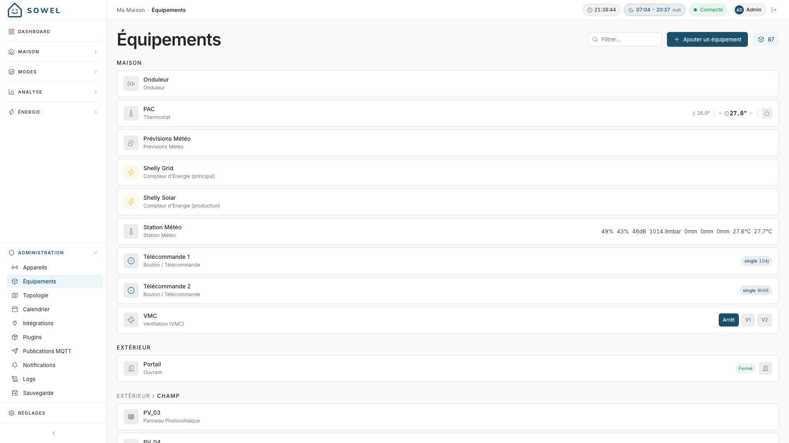

# Équipements

Les équipements sont le concept central de Sowel. Un équipement est une **unité fonctionnelle** avec laquelle vous interagissez au quotidien : "Spots Cuisine", "Volets Chambre", "Capteur Cuisine".

**Un device est ce qui est sur le réseau, un équipement est ce qui est dans la pièce.** Vous ne pensez jamais au module variateur Zigbee installé derrière le mur, vous pensez aux lumières de votre cuisine.

## Créer un équipement

Allez dans **Administration > Équipements** et cliquez sur **Ajouter un équipement**.

### Étape 1 : Informations de base

| Champ       | Obligatoire | Description                                                                             |
| ----------- | ----------- | --------------------------------------------------------------------------------------- |
| Type        | Oui         | La catégorie de l'équipement (voir [Types d'équipements](#types-dequipements) plus bas) |
| Nom         | Oui         | Un nom parlant comme "Spots Cuisine" ou "Capteur Cuisine"                               |
| Zone        | Oui         | À quelle pièce ou zone cet équipement appartient                                        |
| Description | Non         | Une note pour vous-même                                                                 |

!!! info "Le type ne peut pas être modifié après création"
Choisissez le type avec soin, il détermine quels devices sont compatibles et comment l'équipement est affiché.

### Étape 2 : Sélectionner les devices

Cliquez sur **Suivant : Sélectionner les devices** pour voir la liste des devices compatibles. Sowel filtre automatiquement les devices selon le type d'équipement.

- Sélectionnez un ou plusieurs devices
- Cliquez sur **Créer**

**C'est tout.** Sowel crée automatiquement toutes les liaisons de données et de commandes. Chaque valeur que le device expose (température, humidité, batterie...) devient immédiatement disponible sur l'équipement.

!!! tip "Vous pouvez ignorer la sélection de device"
Vous pouvez créer un équipement sans device et en lier un plus tard depuis la page de détail.

### Liaison multi-devices

Un seul équipement peut se lier à **plusieurs devices**. C'est une des fonctionnalités les plus puissantes de Sowel.

**Exemple :** Trois modules variateurs IKEA séparés alimentent les spots de votre cuisine. Créez un seul équipement "Spots Cuisine" et liez les trois. Un seul interrupteur allume les trois. Un seul curseur les variégradue tous les trois.

---

## Types d'équipements

### Lumières

#### Lumière (On/Off)

Contrôle simple on/off d'une lumière.

- **Contrôles :** Bascule ON/OFF
- **Données attendues :** état (on/off)

#### Lumière (Variateur)

Lumière à luminosité réglable.

- **Contrôles :** Bascule ON/OFF + curseur de luminosité
- **Données attendues :** état, niveau de luminosité

#### Lumière (Couleur)

Lumière à couleur réglable, avec température de couleur en option.

- **Contrôles :** Bascule + curseur de luminosité + contrôles de couleur
- **Données attendues :** état, luminosité, couleur, température de couleur

---

### Volets

#### Volet

Volet roulant motorisé, store ou volet.

- **Contrôles :** Boutons Ouvrir / Stop / Fermer, affichage de la position
- **Données attendues :** position (0 % = fermé, 100 % = ouvert)

#### Store banne

Store banne extérieur motorisé.

- **Contrôles :** Boutons Rétracter / Stop / Déployer, affichage de la position
- **Données attendues :** position (0 % = rétracté, 100 % = déployé)

Le store banne partage la surface de contrôle du volet (même binding `shutter_position`, mêmes boutons OPEN/STOP/CLOSE) mais affiche un vocabulaire dédié dans toute l'UI : pastilles _Déployé / Rétracté_, boutons _Déployer / Rétracter_, groupe "Stores bannes" séparé dans la vue zone. Mapping : RF-up = rétracter = position 0, RF-down = déployer = position 100. Le plugin [somfy-rts](https://github.com/mchacher/sowel-plugin-somfy-rts) couvre les deux familles (volets + stores) sur le même matériel Somfy RTS.

---

### Climatisation

#### Thermostat

Contrôle de chauffage ou de climatisation : climatiseur, poêle à granulés, pompe à chaleur.

- **Contrôles :** Affichage de la température, ajustement de la consigne (+/-), allumage/extinction
- **Données attendues :** température courante, consigne cible, état d'alimentation
- **Données additionnelles** (selon le device) : mode de fonctionnement, vitesse du ventilateur, mode éco

#### Radiateur

Radiateur électrique individuel piloté par relais fil pilote.

- **Contrôles :** Bascule Confort / Éco
- **Données attendues :** état du relais (ON = éco, OFF = confort)

#### Chauffe-eau

Chauffe-eau / cumulus piloté par un relais on/off. Le canal on/off est lié automatiquement (ainsi que sa puissance/énergie si le relais les mesure).

- **Contrôles :** Bascule Marche / Arrêt, plus une bascule **Solaire** dédiée lorsqu'un canal solaire est lié
- **Données attendues :** état du relais on/off, température d'eau optionnelle (affichage seul, exclue de la moyenne de température ambiante de la zone), puissance/énergie optionnelles
- **Canal solaire (optionnel) :** un second on/off indépendant, lié sur un contact dédié (par exemple un relais Zigbee contact sec SONOFF MINI-ZBD qui pilote l'entrée photovoltaïque d'un chauffe-eau thermodynamique). Il est distinct de la marche normale de l'appareil : sur un chauffe-eau en alimentation permanente, seule la bascule Solaire apparaît. La carte affiche une bascule par canal lié (Marche/Arrêt si présent, Solaire si présent).
- La consigne réglable est volontairement hors périmètre (ce serait un thermostat). L'équipement fournit le canal de commande solaire (l'actionneur) ; la logique de pilotage sur surplus solaire reste dans une recette qui pilote ce canal via l'arbitre d'énergie.

---

### Accès

#### Portail

Portail, portail coulissant, ou porte de garage.

- **Contrôles :** Bouton Ouvrir/Fermer avec indicateur d'état
- **Données attendues :** état du portail (ouvert, fermé, en ouverture, en fermeture)

!!! tip "Icône du tableau de bord"
Vous pouvez choisir une icône spécifique pour les portails sur le tableau de bord : portail standard, portail coulissant, ou porte de garage.

Un portail peut être piloté par n'importe quel relais on/off : un module contact sec Zigbee (par ex. SONOFF MINI-ZBD), un canal de relais LoRa, ou une télécommande Somfy RTS. Le bouton de commande agit en impulsion ; configurez le comportement d'impulsion (inching / auto-off) sur le module lui-même. Associez un capteur d'ouverture (par ex. SONOFF SNZB-04P) au même équipement pour obtenir l'état ouvert/fermé ; sans capteur, l'état s'affiche comme inconnu.

---

### Capteurs

#### Capteur

Capteur générique qui affiche une ou plusieurs valeurs mesurées. Sowel adapte l'affichage automatiquement selon ce que le device expose.

- **Contrôles :** Affichage en lecture seule avec icônes et unités appropriées
- **Données typiques :** température, humidité, pression, CO2, COV, luminosité, bruit, batterie
- **Capteurs booléens :** mouvement (Mouvement/Calme), contact (Ouvert/Fermé), fuite d'eau, fumée

#### Station météo

Capteur météo extérieur qui fournit les conditions actuelles.

- **Contrôles :** Affichage multi-valeurs
- **Données typiques :** température, humidité, pression, pluie, vent, bruit, batterie
- Les températures (extérieure et intérieure) affichent en dessous le minimum et le maximum mesurés depuis minuit, sur le widget du dashboard comme sur la page de détail. Fonctionne avec toute station qui remonte une température, sans configuration.

#### Prévision météo

Prévision météo sur plusieurs jours depuis une intégration API (par ex. plugin Open-Meteo).

- **Contrôles :** Cartes de prévisions jour par jour avec icônes des conditions
- **Données par jour (J+1 à J+5) :** condition météo, températures min/max, probabilité de pluie, rafales de vent

#### Bouton / Télécommande

Bouton physique ou télécommande. Pas piloté directement, utilisé comme déclencheur d'automatisations.

- **Données :** événements d'action (appui simple, double appui, appui long)
- **Usage :** Déclencher des [recettes](../technical/recipe-development.md) ou basculer des [modes](modes.md)

---

### Énergie

#### Compteur d'énergie

Suit la consommation d'énergie d'un circuit ou d'un device spécifique. Souvent utilisé comme **sous-compteur** sur une ligne dédiée (pompe à chaleur, piscine, borne VE) pour alimenter la [ventilation par usage](energy.md#bascule-total-par-usage) sur la page Énergie.

- **Contrôles :** Affichage de la puissance (W) et de l'énergie quotidienne (Wh/kWh)
- **Données attendues :** énergie cumulée (Wh)

#### Compteur d'énergie principal

Le compteur principal du réseau de votre maison. Un seul autorisé par système.

- **Contrôles :** Identique au compteur d'énergie, plus alimentation de la page [Suivi énergétique](energy.md)
- **Données attendues :** puissance, énergie (avec classification tarifaire HP/HC)

#### Compteur d'énergie de production

Panneau solaire ou autre source de production. Un seul autorisé par système.

- **Contrôles :** Affichage de la production avec calcul d'autoconsommation
- **Données attendues :** puissance de production, production cumulée

---

### Multimédia

#### Lecteur multimédia

TV, barre de son, ou appareil multimédia (par ex. TV Samsung SmartThings).

- **Contrôles :** Allumage/extinction, volume, mute, sélecteur de source d'entrée
- **Données attendues :** état d'alimentation, niveau de volume, mute, source d'entrée courante, mode image
- **Ordres :** allumer/éteindre, régler le volume, basculer mute, changer de source d'entrée

---

### Électroménager

#### Appareil électroménager

Appareil électroménager connecté tel que lave-linge, sèche-linge ou lave-vaisselle (par ex. Samsung SmartThings Washer).

- **Contrôles :** Affichage de statut en lecture seule
- **Données attendues :** état d'alimentation, état de fonctionnement (prêt/en cours/en pause), phase courante (lavage/rinçage/essorage), progression (%), temps restant, consommation d'énergie

!!! tip "Notification de fin de cycle"
Utilisez une recette de surveillance d'état pour être notifié quand l'état de fonctionnement passe de `running` à `ready`.

---

### Eau

#### Vanne d'eau

Vanne d'arrosage connectée pour le jardin. Conçue pour des devices comme la SONOFF SWV qui exposent `state`, `flow`, et les propriétés `irrigation_*`.

- **Contrôles :** Bascule ON/OFF, action minutée "Arroser pendant X min" qui ouvre la vanne et laisse le firmware du device la refermer automatiquement après la durée configurée
- **Métriques live affichées si liées :** débit (m³/h), batterie, statut device (normal / manque d'eau / fuite)
- **Alias standards :** `state`, `flow`, `battery`, `status`, `duration`, `cycles`, `interval`, `capacity`, `autoCloseOnShortage`, seul `state` est requis, l'UI s'adapte à ce qui est lié
- **Agrégation de zone :** compte les vannes ouvertes/totales et somme le débit live sur l'arbre des zones
- **Base pour** de futures recettes d'arrosage automatique (planification consciente de la pluie)

### Caméras

#### Caméra

Type générique, indépendant du fabricant : tout plugin caméra qui remonte les bonnes données peut s'y lier.

- **Contrôles (si liés) :** vue en direct, actualisation de l'aperçu, activer/désactiver la surveillance, spot lumineux, sirène
- **Données attendues (si liées) :** aperçu, flux en direct, état de surveillance, mode du spot, dernière détection

!!! tip "Chaque fonctionnalité est activée à la carte, par caméra"
Qu'une caméra propose un flux en direct, un bouton de surveillance ou remonte des détections dépend uniquement des données/ordres que vous liez — le même mécanisme de liaison que pour tous les autres types d'équipement. Créer une caméra à partir d'un device détecté lie automatiquement l'aperçu, le flux en direct et la bascule de surveillance ; le spot, la sirène et les détections restent à activer manuellement depuis la page de détail ("Ajouter une liaison") si vous le souhaitez. Une fonctionnalité non liée reste inaccessible même via l'API, pas seulement masquée dans l'interface — c'est un choix de confidentialité délibéré, pas qu'une préférence d'affichage.

L'aperçu et le flux en direct passent par le backend de Sowel — votre navigateur ne parle jamais directement à la caméra et n'apprend jamais son adresse réseau.

### Autre

#### Interrupteur / Prise

Simple interrupteur on/off ou prise connectée.

- **Contrôles :** Bascule ON/OFF avec badge d'état
- **Données attendues :** état (on/off)

---

## Gérer les équipements

### Page de détail

Cliquez sur n'importe quel équipement pour voir sa page de détail :

- **Données live** : toutes les valeurs sont mises à jour en temps réel via WebSocket
- **Contrôles** : contrôles interactifs adaptés au type d'équipement
- **Graphique d'historique** : tendances des données dans le temps (si l'historisation est activée)
- **Configuration** : devices liés, liaisons de données, liaisons d'ordres

### Changer le device

Depuis la page de détail, cliquez sur **Changer de device** pour relier l'équipement à un ou plusieurs devices différents. Sowel supprime toutes les liaisons existantes et les recrée automatiquement à partir des nouveaux devices.

### Historisation

Chaque valeur de donnée est historisée vers InfluxDB par défaut, selon sa catégorie (température, humidité, puissance...). Depuis la page de détail, vous pouvez surcharger ce comportement par liaison :

- **Défaut** : suit la règle de la catégorie
- **Forcer ON** : toujours historiser cette valeur
- **Forcer OFF** : ne jamais historiser cette valeur

### Désactiver un équipement

Un équipement désactivé :

- N'apparaît pas dans la vue Accueil
- Est exclu de l'[agrégation de zone](zones.md)
- Ne déclenche pas les recettes ni les impacts de mode
- Reste consultable et modifiable

### Supprimer un équipement

La suppression retire l'équipement de Sowel. Les devices sous-jacents ne sont **pas** affectés, ils restent disponibles pour de nouveaux équipements.

!!! warning
Supprimer un équipement supprime également toutes les instances de recettes et impacts de mode qui le référencent.
