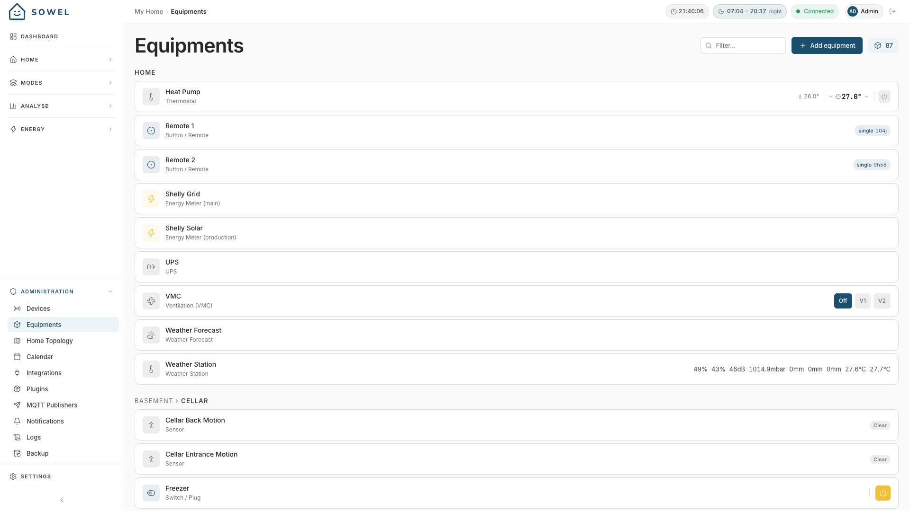

# Equipments

Equipments are the core concept in Sowel. An equipment is a **functional unit** that you interact with daily -- "Living Room Spots", "Bedroom Shutters", "Kitchen Sensor".

**A Device is what's on the network, an Equipment is what's in the room.** You never think about the Zigbee dimmer module installed behind the wall -- you think about your living room lights.

## Creating an equipment

Go to **Administration > Equipments** and click **Add Equipment**.

### Step 1: Basic information

| Field       | Required | Description                                                            |
| ----------- | -------- | ---------------------------------------------------------------------- |
| Type        | Yes      | The equipment category (see [Equipment types](#equipment-types) below) |
| Name        | Yes      | A meaningful name like "Living Room Spots" or "Kitchen Sensor"         |
| Zone        | Yes      | Which room or area this equipment belongs to                           |
| Description | No       | A note for yourself                                                    |

!!! info "Type cannot be changed after creation"
Choose the type carefully -- it determines which devices are compatible and how the equipment is displayed.

### Step 2: Select devices

Click **Next: Select devices** to see a list of compatible devices. Sowel filters devices automatically based on the equipment type.

- Select one or more devices
- Click **Create**

**That's it.** Sowel automatically creates all the data and command bindings. Every value the device exposes (temperature, humidity, battery...) becomes immediately available on the equipment.

!!! tip "You can skip device selection"
You can create an equipment without a device and bind one later from the detail page.

### Multi-device binding

A single equipment can bind to **multiple devices**. This is one of Sowel's most powerful features.

**Example:** Three separate IKEA dimmer modules power the spotlights in your living room. Create one "Living Room Spots" equipment and bind all three. A single toggle turns all three on. A single slider dims all three.

---

## Equipment types

Sowel ships a closed catalogue of equipment types. Every equipment in your home is one of these, and the type drives both the UI controls and the expected data shape.

### Lights

| Type                 | Controls                             | Expected data                               |
| -------------------- | ------------------------------------ | ------------------------------------------- |
| **Light (On/Off)**   | Toggle ON/OFF                        | state (on/off)                              |
| **Light (Dimmable)** | Toggle + brightness slider           | state, brightness                           |
| **Light (Color)**    | Toggle + brightness + color controls | state, brightness, color, color temperature |

### Shutters

| Type        | Controls                                   | Expected data                              |
| ----------- | ------------------------------------------ | ------------------------------------------ |
| **Shutter** | Open / Stop / Close + position display     | position (0% = closed, 100% = open)        |
| **Awning**  | Retract / Stop / Extend + position display | position (0% = retracted, 100% = deployed) |

Awnings share the shutter control surface (same position binding, same OPEN/STOP/CLOSE buttons) but speak the awning vocabulary throughout the UI: _Déployé / Rétracté_ state pills, _Déployer / Rétracter_ button labels, dedicated "Stores bannes" group in the zone view. Mapping: RF-up = retract = position 0, RF-down = deploy = position 100. See the [somfy-rts plugin](https://github.com/mchacher/sowel-plugin-somfy-rts) for an integration example that handles both shutter and awning families against the same Somfy RTS hardware.

### Climate

| Type             | Controls                                        | Expected data                                                                                                      |
| ---------------- | ----------------------------------------------- | ------------------------------------------------------------------------------------------------------------------ |
| **Thermostat**   | Temperature display, setpoint +/-, power on/off | current temperature, target setpoint, power state, optional mode/fan/eco                                           |
| **Heater**       | Comfort / Eco toggle                            | relay state (fil pilote: ON = eco, OFF = comfort)                                                                  |
| **Water Heater** | On/Off toggle, optional dedicated Solar toggle  | on/off relay state, optional solar-channel state, optional water temperature (display only), optional power/energy |

Thermostat covers air conditioning, pellet stoves, and heat pumps. Heater covers individual electric heaters wired through a fil-pilote relay. Water Heater (chauffe-eau / cumulus) is an on/off relay for a hot-water tank: auto-binds the on/off channel (and its power/energy when the relay meters them); a water-temperature probe can be bound optionally and is shown but kept out of the room temperature average. Setpoint control is intentionally out of scope (that would be a thermostat).

A water heater (and a switch) can also carry a dedicated **solar** on/off channel, independent from the main on/off: a second contact (e.g. a SONOFF MINI-ZBD Zigbee dry-contact relay driving the photovoltaic input of a heat-pump water heater). It is bound explicitly under the solar role, distinct from the appliance's normal operation. On a water heater left on permanent mains, only the Solar toggle appears; the card shows one toggle per bound channel. The solar channel is the actuator a solar-surplus recipe drives through the energy arbiter; the arbitration logic itself stays in the recipe.

### Access

| Type     | Controls                            | Expected data                               |
| -------- | ----------------------------------- | ------------------------------------------- |
| **Gate** | Open/Close button + state indicator | gate state (open, closed, opening, closing) |

!!! tip "Dashboard icon"
You can choose a specific icon for gates on the dashboard: standard gate, sliding gate, or garage door.

A gate can be driven by any on/off relay — a Zigbee dry-contact module (e.g. SONOFF MINI-ZBD), a LoRa relay channel, or a Somfy RTS remote — and the command button triggers it as a momentary action. Configure the pulse behavior (inching / auto-off) on the device itself. Bind a door contact sensor (e.g. SONOFF SNZB-04P) to the same equipment to get the open/closed state; without one the state shows as unknown.

### Sensors

| Type                 | Controls / Display                          | Expected data                                                                                                |
| -------------------- | ------------------------------------------- | ------------------------------------------------------------------------------------------------------------ |
| **Sensor**           | Read-only multi-value display, auto-adapted | temperature, humidity, pressure, CO2, VOC, luminosity, noise, battery, motion, contact, water leak, smoke    |
| **Weather Station**  | Multi-value display                         | temperature (with today's measured min/max shown underneath), humidity, pressure, rain, wind, noise, battery |
| **Weather Forecast** | Day-by-day forecast cards (J+1 to J+5)      | weather condition, temperature min/max, rain probability, wind gusts                                         |
| **Button / Remote**  | Not directly controlled (used as trigger)   | action events (single press, double press, long press)                                                       |

The generic **Sensor** type adapts its display automatically. Boolean sensors (motion, contact, water leak, smoke) get appropriate badges; numeric sensors get values with the right unit and icon.

Buttons are inputs only — bind them to a [recipe](recipes.md) action or a [mode](modes.md) toggle through **Administration > Buttons**.

### Energy

| Type                        | Controls / Display                                    | Expected data                                    | Notes                                                                                                                  |
| --------------------------- | ----------------------------------------------------- | ------------------------------------------------ | ---------------------------------------------------------------------------------------------------------------------- |
| **Energy Meter**            | Power (W) and daily energy (Wh/kWh)                   | cumulative energy (Wh)                           | Submeter for a circuit (heat pump, pool, EV charger). Feeds the [by-usage breakdown](energy.md#total-by-usage-toggle). |
| **Main Energy Meter**       | Same + drives the [Energy monitoring](energy.md) page | power, energy (with HP/HC tariff classification) | One allowed per system.                                                                                                |
| **Energy Production Meter** | Production display + autoconsumption calculation      | production power, cumulative production          | One allowed per system.                                                                                                |

### Media

| Type             | Controls                                 | Expected data                                                |
| ---------------- | ---------------------------------------- | ------------------------------------------------------------ |
| **Media Player** | Power on/off, volume, mute, input source | power state, volume level, mute, current input, picture mode |

### Appliances

| Type          | Controls / Display       | Expected data                                                                                                 |
| ------------- | ------------------------ | ------------------------------------------------------------------------------------------------------------- |
| **Appliance** | Read-only status display | power state, operating state (ready/running/paused), current phase, progress (%), remaining time, energy used |

!!! tip "End-of-cycle notification"
Use a `state-watch` recipe to get notified when the operating state changes from `running` to `ready`.

### Water

| Type            | Controls                                                                 | Expected data                                                                    |
| --------------- | ------------------------------------------------------------------------ | -------------------------------------------------------------------------------- |
| **Water Valve** | Toggle ON/OFF, "Water for X min" timed action (firmware-side auto-close) | state, flow rate (m³/h), battery, device status (normal / water shortage / leak) |

Designed for devices like the SONOFF SWV. Standard aliases: `state`, `flow`, `battery`, `status`, `duration`, `cycles`, `interval`, `capacity`, `autoCloseOnShortage`. Only `state` is required — the UI adapts to whichever are bound. Zones aggregate open/total valves and sum live flow across the tree.

### Pool

| Type               | Controls                               | Expected data                                   |
| ------------------ | -------------------------------------- | ----------------------------------------------- |
| **Pool Pump**      | Toggle ON/OFF + daily runtime display  | pump state, daily runtime                       |
| **Pool Cover**     | Open / Stop / Close + position display | cover position (0% = closed, 100% = open)       |
| **Pool Heat Pump** | Power on/off, target water temperature | water temperature, target setpoint, power state |

Pool equipments work with the **Pool Pump Schedule** recipe (daily runtime tied to water temperature) and feed the pool widgets on the dashboard.

### Cameras

| Type       | Controls                                                          | Expected data                                                            |
| ---------- | ----------------------------------------------------------------- | ------------------------------------------------------------------------ |
| **Camera** | Live view, snapshot refresh, monitoring on/off, spot light, siren | snapshot, live stream, monitoring state, spot light mode, last detection |

The **Camera** type is vendor-agnostic — any camera plugin that reports the
right data can bind to it. None of these are required; the detail page only
shows the controls the bound camera actually offers.

!!! tip "Every feature is opt-in, per camera"
Whether a given camera shows a live stream, lets you toggle monitoring, or reports detections is entirely down to which data/orders you bind to it — the same binding mechanism used by every other equipment type. Creating a camera from a discovered device auto-binds the snapshot, live stream and monitoring toggle; the spot light control, siren, and detection events are opt-in — add them later from the equipment's detail page ("Add binding") if you want them. A feature you don't bind is unreachable even via the API, not just hidden — this is a deliberate privacy control, not only a display preference.

Live view and snapshots are proxied through Sowel's backend — your browser
never talks to the camera directly, and never learns its network address.

### Other

| Type              | Controls                    | Expected data                         |
| ----------------- | --------------------------- | ------------------------------------- |
| **Switch / Plug** | Toggle ON/OFF + state badge | state (on/off); optional power/energy |

A **metering plug** (e.g. SONOFF S60ZBTPF) is a `Switch / Plug` that also
reports `power`/`energy`. Bind it as a switch and Sowel automatically captures
the metering: the card shows live power next to the toggle, the consumption
feeds the energy dashboard (history, HP/HC), and the plug appears in the live
submeter breakdown — while keeping its ON/OFF control. A basic relay with no
metering data behaves as a plain switch.

---

## Managing equipments

### Detail page

Click on any equipment to see its detail page:

- **Live data** -- all values updated in real-time via WebSocket
- **Controls** -- interactive controls adapted to the equipment type
- **History chart** -- data trends over time (if historization is enabled)
- **Configuration** -- bound devices, data bindings, order bindings

### Changing the device

From the detail page, click **Change device** to rebind the equipment to different devices. Sowel removes all existing bindings and recreates them automatically from the new device(s).

### Historization

Each data value is historized to InfluxDB by default based on its category (temperature, humidity, power...). From the detail page, you can override this per binding:

| Setting       | Effect                      |
| ------------- | --------------------------- |
| **Default**   | Follows the category rule   |
| **Force ON**  | Always historize this value |
| **Force OFF** | Never historize this value  |

### Disabling an equipment

A disabled equipment behaves as if it weren't there for the engine, while staying visible in the admin UI:

| Where                        | Disabled equipment         |
| ---------------------------- | -------------------------- |
| Home view                    | Hidden                     |
| [Zone aggregation](zones.md) | Excluded                   |
| Recipes                      | Not triggered              |
| Mode impacts                 | Skipped                    |
| Administration > Equipments  | Still visible and editable |

### Deleting an equipment

Deleting removes the equipment from Sowel. The underlying devices are **not** affected -- they remain available for new equipments.

!!! warning
Deleting an equipment also removes any recipe instances and mode impacts that reference it.
