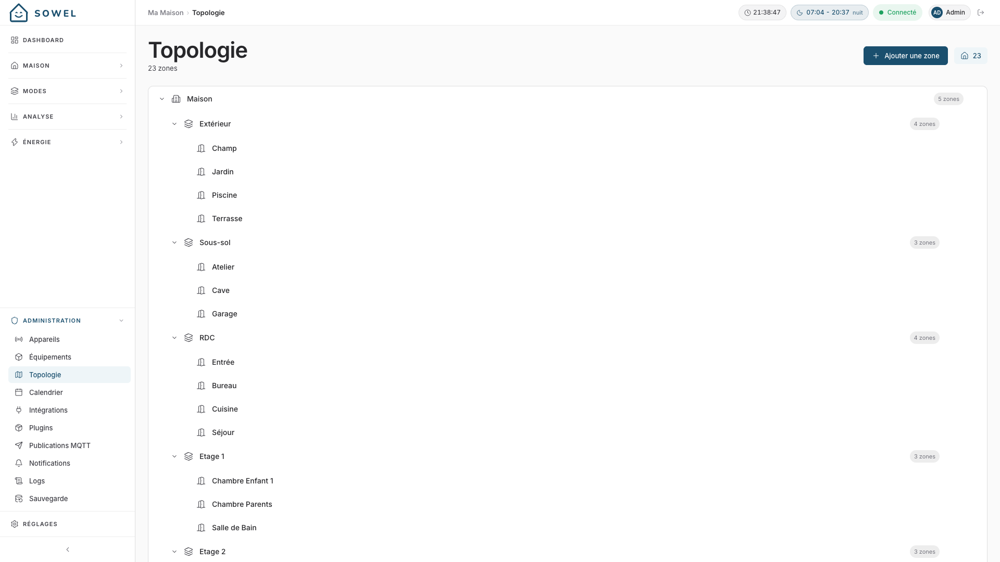
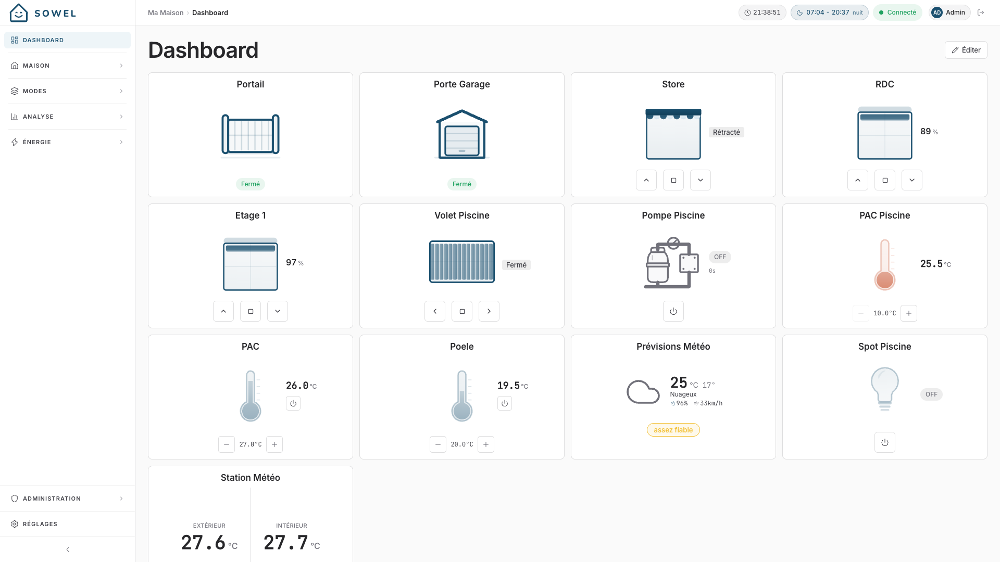

# Premiers pas

Cette page vous guide à travers l'installation de Sowel, la première connexion, et la configuration de votre maison.

## Prérequis

- **Docker** (recommandé) ou **Node.js 20+** pour une installation manuelle
- Au moins une intégration installée depuis le catalogue intégré (**Administration > Plugins**). Sowel propose des plugins pour Zigbee2MQTT, Shelly, Panasonic, MCZ, Netatmo, Legrand, Tasmota, SmartThings, et bien d'autres. Un nouveau plugin s'installe en quelques secondes et le catalogue s'enrichit régulièrement.

!!! tip "Hôte vierge ?"
Si Docker n'est pas encore installé sur votre machine, ou si vous prévoyez d'utiliser des plugins MQTT (Zigbee2MQTT, Tasmota, Shelly...) sans broker existant, consultez d'abord [Préparer l'hôte](host-setup.md). Cette page couvre l'installation de Docker et de Mosquitto sur Raspberry Pi, Debian et Ubuntu.

## Installation

### Option 1 : Installation en une commande (recommandée)

Le plus rapide. Récupère le `docker-compose.yml` officiel, démarre Sowel et InfluxDB ensemble, attend que le moteur réponde, et affiche l'URL quand c'est prêt :

```bash
curl -fsSL https://raw.githubusercontent.com/mchacher/sowel/main/scripts/install.sh | sh
```

Valeurs par défaut :

- Installe dans `~/sowel/` (override avec `SOWEL_DIR=/your/path`)
- Expose Sowel sur le port `3000` (override avec `SOWEL_PORT=8080` par exemple)
- Détecte automatiquement le fuseau horaire de l'hôte et patche le compose

À la fin, ouvrez l'URL affichée dans votre navigateur.

### Option 2 : Installation Docker manuelle

Si vous préférez faire les étapes vous-même :

```bash
mkdir ~/sowel && cd ~/sowel
curl -O https://raw.githubusercontent.com/mchacher/sowel/main/docker-compose.yml
docker compose up -d
```

Cela lance :

- Le **moteur Sowel** sur le port `3000`
- **InfluxDB** sur le port `8086` (utilisé en interne pour les données d'énergie et d'historique)

Ouvrez ensuite votre navigateur :

- **Installation locale** — `http://localhost:3000`
- **Installation distante** (ex. Raspberry Pi, NAS, serveur dédié) — `http://<ip-de-l'hôte>:3000`, où `<ip-de-l'hôte>` est l'adresse LAN de la machine qui fait tourner Sowel

### Option 3 : Depuis les sources (développement)

Pour les contributeurs et développeurs :

```bash
git clone https://github.com/mchacher/sowel.git
cd sowel
npm install
npm run dev                            # backend sur :3000
# dans un autre terminal
cd ui && npm install && npm run dev    # frontend sur :5173 avec hot reload
```

!!! info "Développement vs production"
Avec `npm run dev`, l'UI tourne sur le port 5173 (serveur de dev Vite avec hot reload). En mode Docker, le backend sert directement l'UI sur le port 3000.

## Première connexion

À la première ouverture de Sowel, une **page de configuration** vous demande de créer le compte administrateur :


Remplissez :

1. Un **identifiant** (par ex. `admin`)
2. Un **nom affiché** dans l'UI
3. Un **mot de passe**, confirmé deux fois

Cela crée le premier compte administrateur. Vous pourrez ajouter d'autres utilisateurs plus tard depuis les Réglages.

!!! warning
Il n'existe aucun mécanisme de récupération de mot de passe. Assurez-vous de bien retenir vos identifiants admin.

Une fois le premier compte créé, l'**écran de connexion** classique vous accueille à chaque visite suivante :


## Configuration initiale

Après la connexion, suivez ces étapes pour configurer votre maison.

### Étape 1 : Indiquer où se trouve votre maison

Juste après la création du compte administrateur, Sowel ouvre un **assistant de bienvenue** qui demande le strict minimum nécessaire pour fonctionner correctement : un nom de maison et son emplacement.


Remplissez :

- **Nom de la maison** : un libellé parlant, par ex. `Ma Maison`
- **Latitude** et **Longitude** : les coordonnées géographiques de votre maison. Vous pouvez les obtenir depuis n'importe quel service de cartographie (Google Maps, OpenStreetMap, etc.) en faisant clic droit sur votre emplacement.


Cliquez sur **Continuer**. Sowel enregistre les réglages, déduit le fuseau horaire local des coordonnées, et redémarre le moteur. L'assistant ne réapparaît plus aux connexions suivantes.

!!! warning "Pourquoi c'est obligatoire"
Sans latitude/longitude configurées, Sowel tourne en UTC. La planification de modes par calendrier, les volets au coucher du soleil, et la classification tarifaire HP/HC sur la page Énergie ne fonctionneront pas correctement tant que la localisation de la maison n'est pas définie.

Vous pourrez ajuster plus tard les décalages de lever et coucher depuis les **Réglages** : les valeurs par défaut (30 / 45 minutes) conviennent à la plupart des installations.

### Étape 2 : Installer et configurer les intégrations

Ouvrez **Administration > Plugins** pour parcourir le catalogue, puis **Administration > Intégrations** pour configurer celles que vous avez installées.


Chaque intégration a son propre panneau. Les réglages varient : URL d'un broker MQTT (Zigbee2MQTT, LoRa2MQTT, Tasmota, Shelly), compte cloud (Panasonic, MCZ), identifiants OAuth (Netatmo, Legrand, SmartThings). Chacune embarque un texte d'aide qui décrit ce qu'elle attend.

Chaque intégration affiche un **indicateur de statut de connexion** (vert = connecté). Vous pouvez démarrer, arrêter ou recharger une intégration sans redémarrer le moteur.

!!! tip
Les réglages d'intégration sont stockés dans la base de données, pas dans des fichiers d'environnement. Vous configurez tout depuis l'UI.

### Étape 3 : Vérifier la découverte des devices

Allez dans **Administration > Devices**.


Une fois qu'une intégration est connectée, les devices apparaissent automatiquement. Le tableau affiche :

- Le nom du device et l'intégration source (Z2M, LORA2MQTT, MCZ, etc.)
- Le fabricant et le modèle
- Le statut de connexion (point vert = en ligne)
- Le lien à l'équipement (s'il est déjà affecté)

Utilisez les onglets d'intégration en haut pour filtrer par source. Si les devices n'apparaissent pas, vérifiez que votre intégration est connectée (indicateur vert) et que les devices sont appairés à votre coordinateur ou enregistrés sur votre compte cloud.

### Étape 4 : Créer la topologie de vos zones

Allez dans **Administration > Topologie**.



Construisez la structure spatiale de votre maison sous forme d'arbre imbriquable. Une configuration typique :

```
Home
  Ground Floor
    Living Room
    Kitchen
    Hallway
  First Floor
    Master Bedroom
    Kids Room
    Bathroom
  Outdoor
    Garden
    Garage
```

Utilisez le bouton **+ Ajouter une zone** pour créer des zones, et les boutons fléchés pour les réordonner. Les zones peuvent être imbriquées sur n'importe quelle profondeur. L'arbre des zones apparaît dans la barre latérale Accueil pour la navigation quotidienne.

### Étape 5 : Créer les équipements

Allez dans **Administration > Équipements**.

Pour chaque unité fonctionnelle de votre maison :

1. Cliquez sur **Ajouter un équipement**
2. Choisissez un type (lumière, volet, capteur, thermostat, portail, vanne d'eau, etc.)
3. Donnez-lui un nom (par ex. "Spots Cuisine")
4. Affectez-le à une zone
5. Liez les données et les commandes des devices

!!! tip
Un seul équipement peut se lier à plusieurs devices. Par exemple, trois modules variateurs derrière le mur peuvent être regroupés en un seul équipement "Spots Cuisine". Un seul interrupteur les contrôle tous les trois.

### Étape 6 : Profiter de la vue Accueil

Allez sur **Accueil** dans la barre latérale.


L'arbre des zones apparaît à gauche. Cliquez sur n'importe quelle zone pour voir :

- **L'état agrégé** : température, humidité, luminosité, mouvement, nombre de lumières, position des volets
- **Les commandes de zone** : actions groupées (toutes lumières on/off, tous volets ouverts/fermés)
- **Les cartes d'équipement** : groupées par type (Thermostat, Énergie, Météo, etc.) avec contrôles intégrés
- **Les comportements** : recettes et modes configurés pour cette zone

### Étape 7 : Personnaliser le tableau de bord

Allez sur **Tableau de bord** et cliquez sur **Éditer**.



Ajoutez des widgets pour les équipements et zones que vous utilisez le plus. Les widgets se mettent à jour en temps réel via WebSocket. Vous pouvez les réordonner par glisser-déposer, les renommer, et personnaliser leurs icônes.

Votre maison est maintenant configurée. À partir de là, vous pouvez :

- [Personnaliser votre tableau de bord](dashboard.md) avec plus de widgets
- [Configurer des modes](modes.md) pour différents scénarios (Confort, Absence, Nuit)
- [Suivre la consommation d'énergie](energy.md)

## Variables d'environnement

Sowel fonctionne d'emblée avec des valeurs par défaut raisonnables. Pour une configuration avancée, vous pouvez définir des variables d'environnement dans un fichier `.env` à la racine du projet :

| Variable        | Défaut                  | Description                                      |
| --------------- | ----------------------- | ------------------------------------------------ |
| `SQLITE_PATH`   | `./data/sowel.db`       | Emplacement du fichier de base de données        |
| `API_PORT`      | `3000`                  | Port du serveur HTTP                             |
| `API_HOST`      | `0.0.0.0`               | Adresse de bind                                  |
| `LOG_LEVEL`     | `info`                  | Niveau de log (`debug`, `info`, `warn`, `error`) |
| `CORS_ORIGINS`  | `*`                     | Origines CORS autorisées                         |
| `INFLUX_URL`    | `http://localhost:8086` | URL InfluxDB                                     |
| `INFLUX_ORG`    | `sowel`                 | Organisation InfluxDB                            |
| `INFLUX_BUCKET` | `sowel`                 | Bucket principal InfluxDB                        |

!!! note
`JWT_SECRET` et `INFLUX_TOKEN` sont auto-générés au premier lancement et persistés dans le répertoire `data/`. Vous n'avez pas besoin de les définir manuellement.
