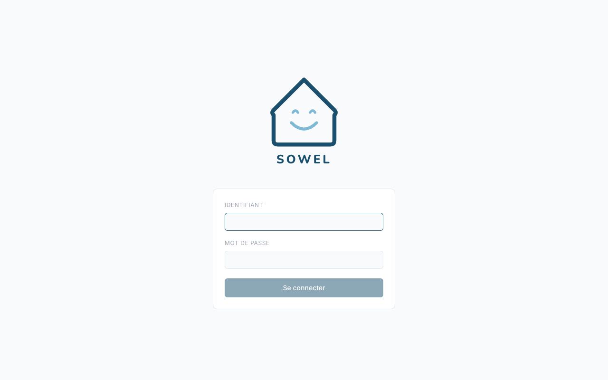
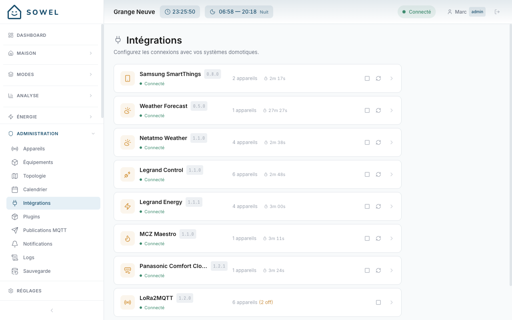
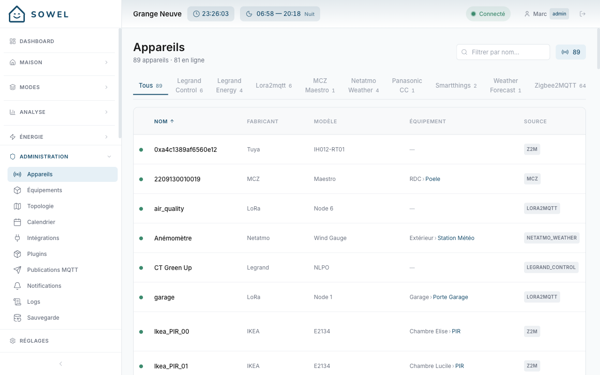
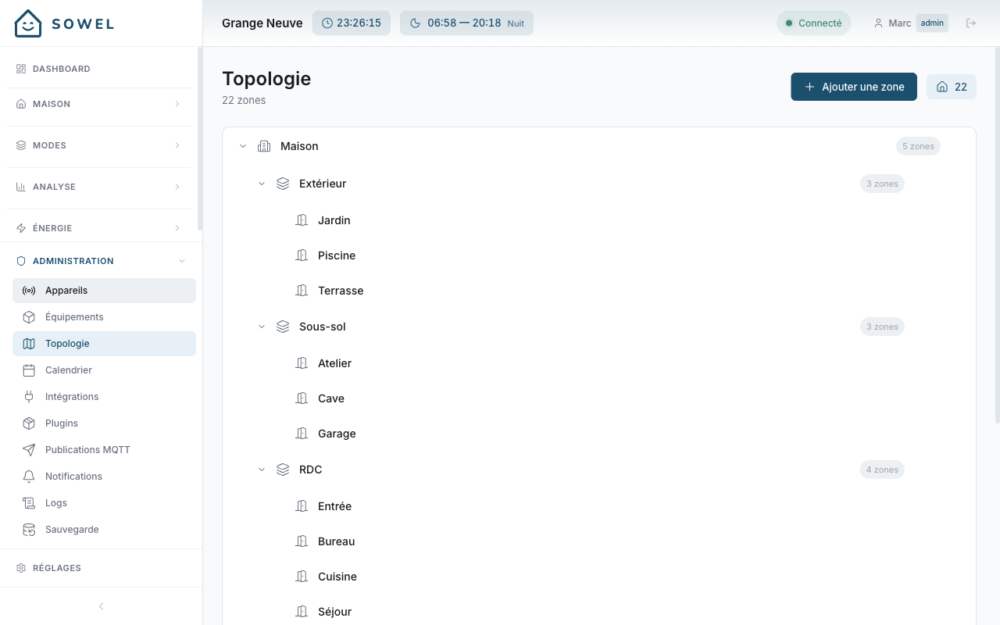
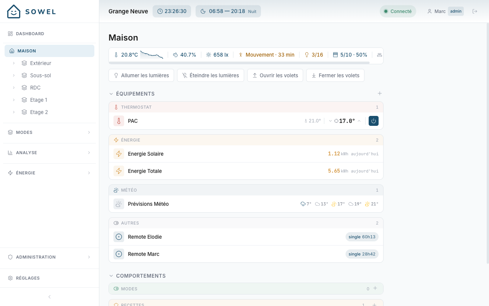
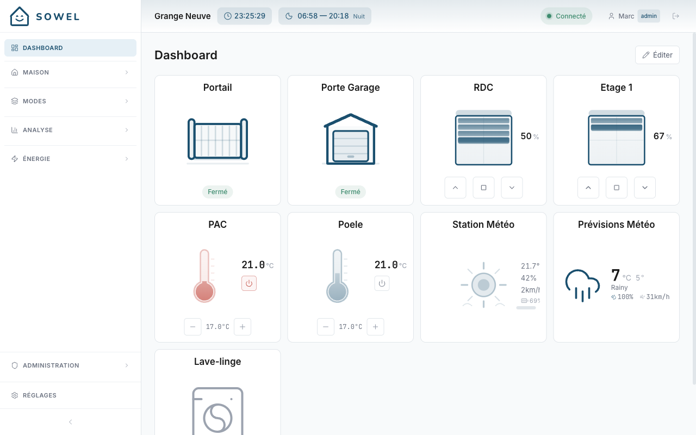

# Getting Started

This page walks you through installing Sowel, logging in for the first time, and configuring your home.

## Prerequisites

- **Docker** (recommended) or **Node.js 20+** for manual installation
- At least one supported integration:
  - **Zigbee2MQTT** with an MQTT broker (Mosquitto or similar)
  - **Panasonic Comfort Cloud** account (for AC units)
  - **MCZ Maestro** account (for pellet stoves)
  - **Netatmo Weather** (for weather stations)
  - **Legrand Energy / Control** (for energy monitoring, lights, shutters)
  - **LoRa2MQTT** (for LoRa devices via a lora2mqtt bridge)

## Installation

### Option 1: Docker (recommended)

Docker is the easiest way to run Sowel. It bundles the engine and InfluxDB together.

```bash
git clone <repo>
cd sowel
docker-compose up -d
```

This starts:

- **Sowel engine** on port `3000`
- **InfluxDB** on port `8086` (used internally for energy and history data)

Open your browser to **http://localhost:3000**.

### Option 2: Manual installation

```bash
git clone <repo>
cd sowel
npm install
```

Start the backend:

```bash
npm run dev
```

In a separate terminal, start the frontend:

```bash
cd ui
npm install
npm run dev
```

Open your browser to **http://localhost:5173**.

!!! info "Development vs production"
When running manually with `npm run dev`, the UI runs on port 5173 (Vite dev server with hot reload). In Docker or production mode, the backend serves the UI directly on port 3000.

## First login

When you open Sowel for the first time, a **setup page** appears. Create your admin account:

1. Choose a username
2. Set a password
3. Enter a display name

After the first account is created, the login screen greets you:



This creates the first administrator account. You can add more users later from Settings.

!!! warning
There is no password recovery mechanism. Make sure you remember your admin credentials.

## Initial configuration

After logging in, follow these steps to set up your home.

### Step 1: Configure integrations

Go to **Administration > Integrations** in the sidebar.



Each integration has its own settings panel. Click on an integration to expand it and configure the connection. Common settings:

| Integration                 | What to configure                                           |
| --------------------------- | ----------------------------------------------------------- |
| **Zigbee2MQTT**             | MQTT broker URL (e.g., `mqtt://localhost:1883`), base topic |
| **Panasonic Comfort Cloud** | Email and password for your Panasonic account               |
| **MCZ Maestro**             | Email and password for your MCZ account                     |
| **Netatmo Weather**         | OAuth credentials (client ID, client secret, tokens)        |
| **Legrand Energy/Control**  | OAuth credentials (client ID, client secret, tokens)        |
| **LoRa2MQTT**               | MQTT broker URL, base topic                                 |

Each integration shows a **connection status indicator** (green = connected). You can start/stop integrations and trigger a manual refresh without restarting the engine.

!!! tip
Integration settings are stored in the database, not in environment files. You configure everything from the UI.

### Step 2: Verify device discovery

Go to **Administration > Devices**.



Once an integration connects, devices appear automatically. The table shows:

- Device name and source integration (Z2M, LORA2MQTT, MCZ, etc.)
- Manufacturer and model
- Connection status (green dot = online)
- Equipment binding (if already assigned)

Use the integration tabs at the top to filter by source. If devices do not appear, check that your integration is connected (green indicator) and that devices are paired with your coordinator or registered in your cloud account.

### Step 3: Create your zone topology

Go to **Administration > Topology**.



Build the spatial structure of your home as a nestable tree. A typical setup:

```
Home
  Ground Floor
    Living Room
    Kitchen
    Hallway
  First Floor
    Master Bedroom
    Kids Room
    Bathroom
  Outdoor
    Garden
    Garage
```

Use the **+ Add zone** button to create zones, and the arrow buttons to reorder them. Zones can be nested to any depth. The zone tree appears in the Home sidebar for daily navigation.

### Step 4: Create equipments

Go to **Administration > Equipments**.

For each functional unit in your home:

1. Click **Add Equipment**
2. Choose a type (light, shutter, sensor, thermostat, gate, water valve, etc.)
3. Give it a name (e.g., "Living Room Spots")
4. Assign it to a zone
5. Bind the device data and orders

!!! tip
A single equipment can bind to multiple devices. For example, three dimmer modules behind the wall can be grouped as one "Living Room Spots" equipment. One toggle controls all three.

### Step 5: Enjoy the Home view

Go to **Home** in the sidebar.



The zone tree appears on the left. Click any zone to see:

- **Aggregated status** -- temperature, humidity, luminosity, motion, lights count, shutter positions
- **Zone commands** -- batch actions (all lights on/off, all shutters open/close)
- **Equipment cards** -- grouped by type (Thermostat, Energy, Weather, etc.) with inline controls
- **Behaviors** -- recipes and modes configured for this zone

### Step 6: Customize the dashboard

Go to **Dashboard** and click **Edit**.



Add widgets for the equipment and zones you use most. Widgets update in real-time via WebSocket. You can reorder them by drag-and-drop, rename them, and customize their icons.

Your home is now set up. From here, you can:

- [Customize your dashboard](dashboard.md) with more widgets
- [Set up modes](modes.md) for different scenarios (Comfort, Away, Night)
- [Monitor energy consumption](energy.md)

## Environment variables

Sowel works out of the box with sensible defaults. For advanced configuration, you can set environment variables in a `.env` file at the project root:

| Variable        | Default                 | Description                                      |
| --------------- | ----------------------- | ------------------------------------------------ |
| `SQLITE_PATH`   | `./data/sowel.db`       | Database file location                           |
| `API_PORT`      | `3000`                  | HTTP server port                                 |
| `API_HOST`      | `0.0.0.0`               | Bind address                                     |
| `LOG_LEVEL`     | `info`                  | Logging level (`debug`, `info`, `warn`, `error`) |
| `CORS_ORIGINS`  | `*`                     | Allowed CORS origins                             |
| `INFLUX_URL`    | `http://localhost:8086` | InfluxDB URL                                     |
| `INFLUX_ORG`    | `sowel`                 | InfluxDB organization                            |
| `INFLUX_BUCKET` | `sowel`                 | InfluxDB primary bucket                          |

!!! note
`JWT_SECRET` and `INFLUX_TOKEN` are auto-generated on first launch and persisted in the `data/` directory. You do not need to set them manually.
