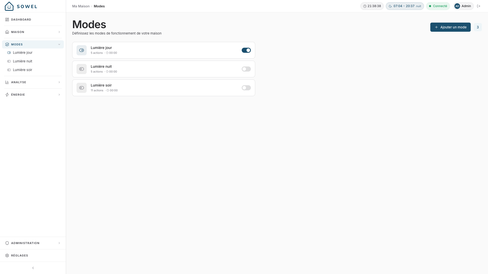
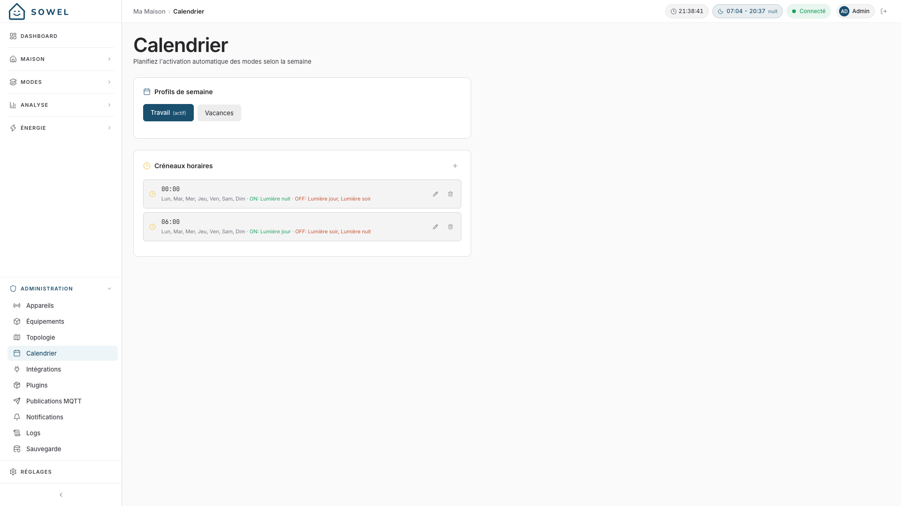

# Modes

Les modes sont des **profils de fonctionnement nommés** pour votre maison. Un mode représente un état de vie : "Confort", "Absence", "Nuit", "Éco", et il définit ce qui se passe dans chaque pièce quand le mode est activé.

## Comprendre les modes

Voyez les modes comme des préréglages pour toute votre maison. Au lieu d'éteindre manuellement les lumières, fermer les volets et baisser le chauffage en partant, vous activez le mode "Absence" et tout se fait d'un coup.

**Exemples de modes** :

| Mode        | Description                                         |
| ----------- | --------------------------------------------------- |
| **Confort** | Chauffage allumé, lumières chaudes et lumineuses    |
| **Nuit**    | Lumières tamisées, volets fermés, chauffage abaissé |
| **Absence** | Tout éteint, sécurité activée                       |
| **Éco**     | Chauffage réduit, lumières seulement si nécessaire  |

Un seul mode peut être actif à la fois. L'activation d'un nouveau mode désactive le précédent.

## Créer un mode

Allez dans **Administration > Modes** et cliquez sur **Ajouter un mode**.

1. Saisissez un **nom** (par ex. "Nuit")
2. Ajoutez une **description** facultative

Le mode est créé mais n'a aucun effet pour l'instant. Ensuite, vous devez définir des **impacts** : ce qui se passe dans chaque zone quand le mode s'active.

## Définir les impacts

Un impact est ce qui se passe dans une zone précise quand le mode est activé. Allez dans la page de détail du mode, puis configurez les impacts par zone.

### Types d'impacts

Chaque impact peut contenir une ou plusieurs **actions** :

**Actions d'ordre** : envoyer une commande à un équipement :

- Éteindre les lumières de la cuisine
- Fermer les volets de la chambre
- Régler le thermostat à 18 °C

**Actions de bascule de recette** : activer ou désactiver une recette :

- Désactiver la lumière déclenchée par mouvement dans la chambre (pour qu'elle ne s'allume pas la nuit)
- Activer une recette d'économie d'énergie en mode Éco

### Exemple : mode Nuit

| Zone            | Actions                                      |
| --------------- | -------------------------------------------- |
| Living Room     | Toutes lumières éteintes, volets fermés      |
| Kitchen         | Toutes lumières éteintes                     |
| Master Bedroom  | Luminosité à 20 %, volets fermés             |
| Hallway         | Désactiver la recette de lumière à mouvement |
| Toute la maison | Régler le thermostat à 18 °C                 |

## Activer les modes

Il existe trois façons d'activer un mode :

### Activation manuelle

Depuis **Modes** dans le menu, ou depuis la page du mode, basculez l'interrupteur à côté de lui. Le mode prend effet immédiatement.

**Tout utilisateur peut activer un mode**, pas seulement un administrateur : basculer la maison en Nuit ou en Absent fait partie du quotidien du foyer. Créer un mode, le renommer et choisir ce qu'il fait à chaque zone restent réservés aux administrateurs, si bien que ce qu'un mode applique a toujours été décidé par un administrateur.

### Déclencheurs par événement

Un mode peut être déclenché par un événement de device, typiquement un appui sur un bouton.

**Exemple** : vous avez un bouton Zigbee sur votre table de chevet. Configurez-le comme déclencheur du mode "Nuit" : un appui sur le bouton, et toute la maison bascule en configuration nuit.

Pour ajouter un déclencheur d'événement :

1. Ouvrez la page de détail du mode
2. Ajoutez un déclencheur
3. Sélectionnez l'équipement (par ex. votre bouton)
4. Sélectionnez l'alias de donnée (par ex. "action")
5. Réglez la valeur de déclenchement (par ex. "toggle" ou "single press")

!!! tip
Un seul bouton peut déclencher différents modes pour différentes actions. Par exemple : appui simple pour "Nuit", double appui pour "Absence".

### Planification calendaire

Les modes peuvent être activés automatiquement selon une grille hebdomadaire. Voir [Planification calendaire](#planification-calendaire) ci-dessous.

## Planification calendaire

Le calendrier gère des **profils hebdomadaires** d'activation automatique de modes. C'est ainsi que vous automatisez votre routine quotidienne.

### Profils

Un profil est une grille hebdomadaire nommée. Vous pourriez avoir :

- **Semaine** : votre routine régulière du lundi au vendredi
- **Week-end** : une grille différente pour samedi et dimanche
- **Vacances** : grille relâchée quand vous êtes à la maison toute la journée

Un seul profil est actif à la fois. Basculez d'un profil à l'autre en un seul geste.

### Créneaux horaires

Chaque profil contient des créneaux horaires. Un créneau définit :

- **Jour(s)** : quels jours de la semaine (lun, mar, mer, etc.)
- **Heure** : à quelle heure le mode s'active
- **Mode(s)** : quel(s) mode(s) activer

**Exemple : profil Semaine**

| Jours   | Heure | Mode    |
| ------- | ----- | ------- |
| Lun-Ven | 07:00 | Confort |
| Lun-Ven | 09:00 | Absence |
| Lun-Ven | 18:00 | Confort |
| Lun-Ven | 22:30 | Nuit    |
| Sam-Dim | 09:00 | Confort |
| Sam-Dim | 23:00 | Nuit    |

### Gérer le calendrier

Allez dans **Administration > Calendrier** :

1. Créez ou sélectionnez un profil
2. Ajoutez des créneaux (jour + heure + mode)
3. Définissez le profil comme actif

Les créneaux du profil actif s'exécutent automatiquement. Quand un créneau horaire est atteint, le mode spécifié est activé.

!!! info
L'activation manuelle d'un mode est toujours prioritaire. Si vous activez un mode manuellement, il reste actif jusqu'au prochain créneau du calendrier ou jusqu'à ce que vous le changiez à la main.

## Astuces

- **Commencez simple** : démarrez avec 2 ou 3 modes (Confort, Nuit, Absence) et étoffez ensuite.
- **Utilisez les zones intelligemment** : toutes les zones n'ont pas besoin d'un impact pour chaque mode. Définissez des impacts uniquement là où le mode doit réellement changer quelque chose.
- **Combinez avec les recettes** : les modes peuvent activer/désactiver des recettes. C'est puissant : par exemple, désactiver les lumières à détection de mouvement dans les chambres en mode Nuit pour que les mouvements n'allument pas les lumières.
- **Calendrier pour la routine, boutons pour les exceptions** : utilisez le calendrier pour votre routine quotidienne et les déclencheurs par bouton pour les changements ponctuels.
