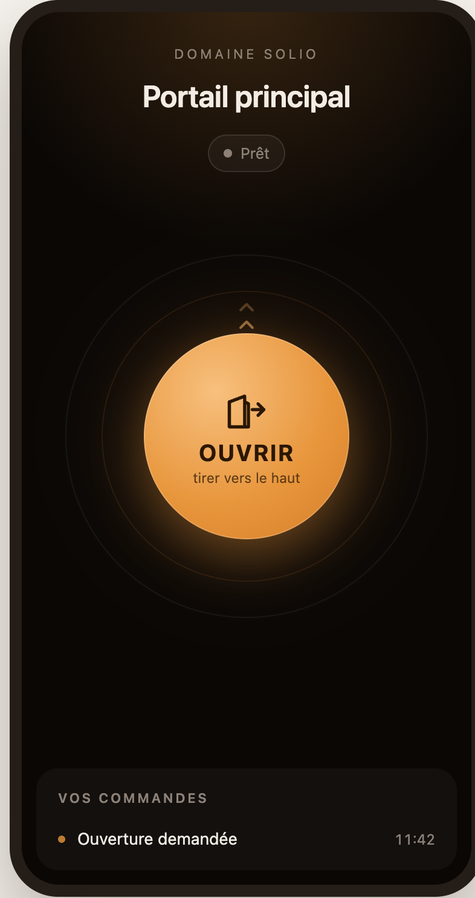
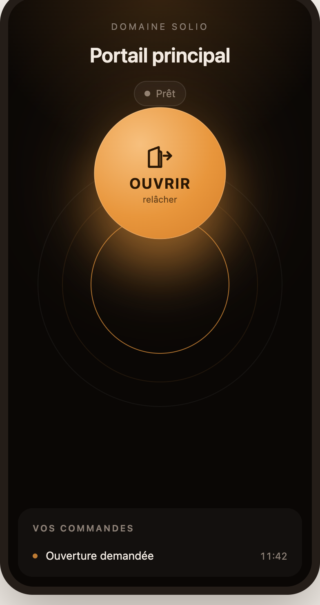
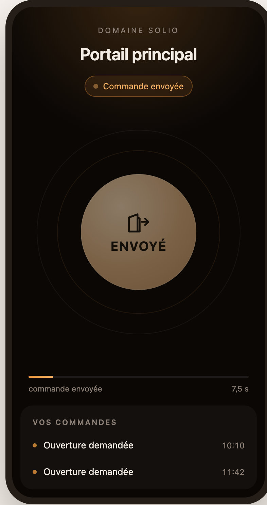
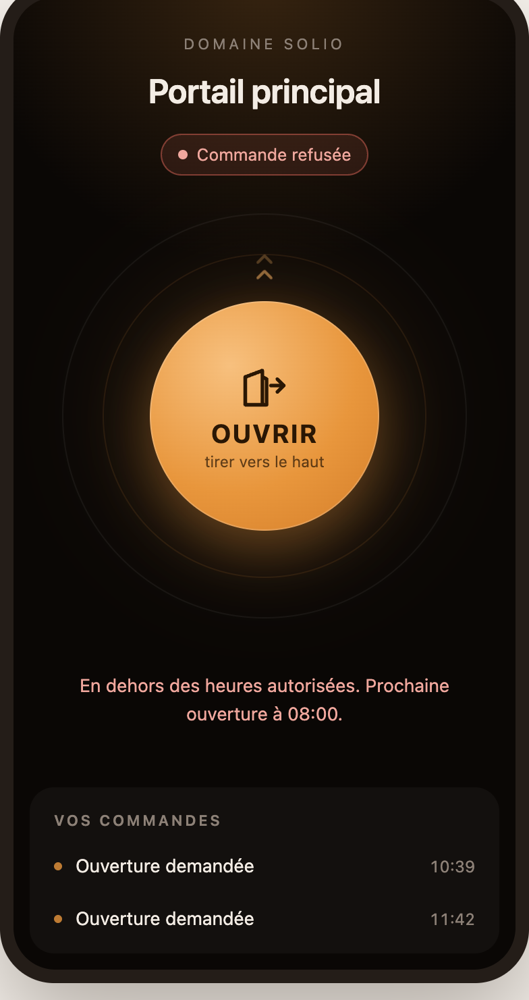
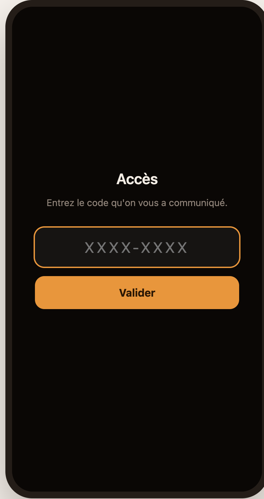

# Spec 181 — Shared access: let someone open a gate, for a while

**Status**: implemented on `feat/shared-access` (PR #970), awaiting review
**Scope**: an opt-in core feature, off by default. Gates only (`gate` equipments) in this spec.

## Problem

A household regularly needs to let **someone who is not a Sowel user** open a gate or a garage door
for a while: a child coming home from school, a tradesperson on Tuesday, a neighbour watering the
plants in August, the guests of a holiday let. Today the options are to hand over a remote, to give
out a Sowel account (which opens everything), or to open it yourself from your phone.

What is wanted is narrower than an account and safer than a remote: **a code or a link, valid for a
period and at certain hours, that opens only the gates it names, that can be held or revoked in one
click, and that leaves a journal.**

## Why in the core, and not as a plugin

Sowel's rule since spec 053 is that integrations and recipes are plugins. This was first built that
way — a plugin, a recipe and a core PR ([#969](https://github.com/mchacher/sowel/pull/969)) — and
the attempt is the argument:

1. **It needed three new core capabilities with a single consumer**: plugin pages in the SPA, an
   anonymous HTTP tree for plugins, and a card on an equipment's page. Generic in name, justified by
   one plugin.
2. **A plugin may not actuate an equipment**, rightly. So the opening went through a recipe, with a
   hand-made protocol between the two (a request counter, the target gate written just before it, a
   JSON catalogue of the house's gates pushed back down, an answer order). Three packages to install
   and wire for one feature, and a protocol that exists only because of the boundary.
3. **The anonymous surface is the security-sensitive part**, and it is safer written once, in the
   core, with its own rate limiting, headers and tests, than opened generically to any plugin.
4. **It is not specific to anyone.** Children, tradespeople, neighbours, guests: it is the same
   feature, like the timed command (spec 174) and the confirmation before action (spec 146), which
   are core features on the same `gate` equipments.

It is **opt-in and off by default**: an installation that never enables it sees no page, no card
and no public URL, and nothing in its behaviour changes. What stays out of the core is anything
specific to a booking system: a guestFlow connector is a plugin, feeding accesses through the API in
R9 (see _Consumers_).

## Vocabulary

- **Shared access** (_Accès partagés_): the feature.
- **Access**: one person's right to open — a label, a link, optionally a code, the gates it opens,
  a validity.
- **Gate** (in this spec): a `gate` equipment. Nothing is turned on per gate: any of them can be
  listed on an access.
- **Phone**: a device that has been set up on an access from its link or its code; it keeps a token.

## Functional rules

### R1 — Opt-in

1. A core setting `sharedAccess.enabled`, **false by default**, turned on and off in Settings by an
   admin. Audit-logged.
2. While it is off: no navigation entry, no card on equipment pages, every shared-access API route
   and the public page answer **404** — the same 404 as an unknown route, so the feature cannot be
   probed from outside. The data is kept; turning it back on restores everything as it was.

### R2 — Gates

3. **Any `gate` equipment of the house can be listed on an access** — from the shared-access page
   (« + portail ») or from the gate's own page (R8). Nothing is turned on per gate. The server checks
   the type (`unsupported_equipment`); other types are a later decision, one type at a time.
4. Each gate carries an **armed switch**, on its own page and on its tab. Disarmed, a press is
   refused and the phone is told the house refused it; the accesses are kept. Disarming the garage
   does not affect the entrance gate. The switch is the feature's own data, not a column on
   `equipments`.
5. **A press sends what the gate's own button sends**: its `command` order (spec 146). On an impulse
   gate there is nothing to choose; when the command has enum values (`open` / `close` / `stop`), the
   access stores which one opens, picked when the gate is listed on it.
6. Deleting the equipment removes it from every access; an access left with no gate cannot open and
   says so on the owner's page.

### R3 — Accesses

7. An access carries a **label** (required), **the gates it opens** (at least one, `no_gate`
   otherwise), and a **kind**: `manual` (made on the page) or `external` (made by a plugin, R9).
8. **The link** carries a random token of its own, 128 bits: it cannot be guessed, and only its
   SHA-256 is stored. **The code** is optional per access, on by default: eight characters of
   Crockford base32 without I, L, O, U, shown `4K7M-9QT2`, compared with dashes, spaces and case
   stripped and those four letters folded onto what they are mistaken for. It is **unique among
   everything that can still open** — it identifies the access on its own. It is **kept in clear**:
   someone whose phone is flat must be read their code over the telephone, which a hash forbids. It
   is nulled seven days after the access ends. Only codes are exposed to guessing (R6).
9. **One « Change the code »**, which renews the code (when the access has one) and the link
   together, with a choice: keep the phones already set up (the lost email), or cut them off too
   (the lost phone).
10. **Validity is two separate groups**, on the house's wall clock (`home.timezone`, spec 061):
    - **Dates**: « Tout le temps » — no date is shown or stored — or « Du … au … » (from, until).
    - **Heures**: « Toute la journée » — no hour is shown or stored — or « Par plages », one or
      more time windows every day (`08:00–20:00`), not crossing midnight, not overlapping.

    The same two groups are used on accesses and on profiles (R9). An external access carries its
    source's dates; the owner may **widen** them only — open earlier, extend later.

11. **Hold / resume**, **revoke**, and **delete only once revoked or ended** (`still_live`
    otherwise): deleting a live access used to be revoking and erasing the line in one click. The
    journal outlives the access.

### R4 — When a press opens

12. In order: not revoked → not suspended → inside the validity → inside a time window if any →
    the gate is one the access lists (`not_this_gate`) → the gate is armed (`refused_by_house`) →
    under the ceilings. **The decision comes first**: a refused press never reaches the gate.
13. **Ceilings**: 12 opens per hour per access, 30 per hour per gate.
14. Two presses of the same access within two seconds are one press. Presses queue per gate.
15. **The core sends the gate's command itself**, through `EquipmentManager.executeOrder`, so it
    inherits inversion (spec 154), value resolution (spec 150) and delivery confirmation (spec 141).
    The order carries a new `OrderSource` member, `{ kind: "shared_access", accessId, label }`, shown
    in the Activity feed as « Accès partagé — <label> ».
16. **The gate's state never reaches the phone.** The page is pollable by anyone holding a code; a
    button reading « Fermer » is a state display wearing a verb.

### R5 — The public page

17. Served by the core at **`/access/`**, a few kilobytes of HTML, CSS and JavaScript of its own —
    not the SPA, not a framework — with `default-src 'none'`-style CSP, `X-Robots-Tag: noindex`,
    `Cache-Control: no-store` and no cookie. Its API is `/api/v1/shared-access/public/*`, the only
    shared-access routes outside authentication. They carry **no per-IP limit**, for the reason R6
    gives: behind the proxy it would be one limit for the whole internet, which one script exhausts
    for every visitor. Failing enrolments are governed by R6, presses by the ceilings of R4.13.
18. The invitation link carries its own token **in the fragment** (`/access/#i=…`), which no
    server, proxy or log sees; it is consumed once and removed from the address bar. An **alias**
    (another host name rewriting to `/access/`) is supported: a public base URL and path set in
    Settings build the links.
19. A phone keeps its **own token**; only its SHA-256 is stored. More than six phones on one access
    raises an alarm — information, never a block. Nothing is asked of the visitor to name a phone:
    the owner sees each one as its platform, read from the browser, and a four-character tag
    drawn from its id — « iPhone · 7K3F » — with when it was set up and last seen, and can **cut
    one phone** on its own. A cut phone falls back to the code screen; the others keep opening.
20. **The control is a movement, not a button to validate.** The gate is one warm disc in the
    middle of a dark screen; the visitor **pulls it upward out of its socket**, and the command
    leaves only once the disc has cleared the socket. Released short, the disc falls back and
    nothing was sent — a phone in a pocket, a child playing with the screen, a thumb on a page
    still loading never open anything. Two faint chevrons above the disc announce the direction
    before the finger lands; the socket stays drawn where the disc was, and firms up as the
    distance is covered. One disc per gate the access opens, titled by the equipment's name when
    there are several.
21. The gesture has a way round for whoever cannot perform it: **the keyboard confirms** — Enter
    on the focused disc, then Enter again within three seconds — because a gesture nobody can
    perform is a gate nobody can open. (The core's slide-to-confirm of spec 146 is a component of
    the SPA, which this page does not carry.)
22. **What the page shows of the command is the echo of the visitor's own presses, never the
    state of the gate.** After the disc is released: the disc dims, a pill reads « Commande
    envoyée », a thin bar runs for the gate's travel time (30 s: the core declares none for a
    gate), and one line under the disc reads « Dernière ouverture demandée à 18:42 ». The page never
    says whether the gate is open, closed or moving (R4.16); it speaks in words only when the gate
    will not move, and then it says why. **The page holds on one screen and never scrolls**; a
    short screen shrinks the disc. A gear opens **Réglages**: « Vos commandes » — this phone's last
    eight presses, the ones it made itself — and **« Partager cet accès »**, the invitation link as
    a QR code for a companion to scan, with « Copier le lien ». No code is shown on the page. The
    QR code is drawn by the core, so the page carries no library; it is refused once the access
    has ended, and while the house has no public address.
23. French on a phone set to French, **English on every other phone** — the phone's first
    language decides. Words assume no holiday let. Before a code is
    typed, the title names a door only if the house has one gate.

The page as it stands, from the mock-up validated on 2026-09-23
(`visitor-page.html`, which keeps the three gestures that were turned down beside this one):

| At rest                           | Pulled to the release point          | Command gone                      | Refused                              |
| --------------------------------- | ------------------------------------ | --------------------------------- | ------------------------------------ |
|  |  |  |  |

And what is seen before a code is known: 

### R6 — Guessing codes

24. **A correct code is never refused by the anti-guessing budget.** The code is looked up first;
    only failures are counted, **globally** — behind a reverse proxy the core sees the proxy's
    address, not the visitor's, so « N tries per IP » would be N tries for the whole internet.
    Ten failures in ten minutes are free, then each failing answer is held back 1 s, 2, 4, 8, up to
    10 s. Past 25 failures in the window the owner is alerted once. A wrong link token counts as a
    failure like a wrong code. No code is ever locked: a live code tried is a success, and a code
    that matches nothing has nothing to lock. Per-visitor counting needs trusted-proxy
    configuration and is a separate spec.
25. **Parallel guessing is bounded by a cap on held answers**: at most 32 failing answers are held
    at once; past that, a failure is answered at once with `too_many` — still no success, and no
    more sockets kept open. In front of the core, the reverse proxy's own quota (Caddy, CrowdSec)
    bounds the request rate. The order of magnitude: a guesser needs about 2⁴⁰ tries against a
    handful of live codes, and the owner is alerted from the 26th failure. An access without a
    code (R3.8) offers nothing to guess.

### R7 — The owner's page

26. **« Accès partagés » in the main navigation**, after Analyse — used day to day, not configured
    once. Admin-only.
27. **A tab per gate** listed on at least one access, « Tous » once there are two, « + portail »
    (picks a gate and opens a new access on it). On « Tous » each line says which gates it opens.
28. Each line: label, code, validity, hours, phones, last use; Sowel's icons for **copy the link**,
    **edit**, **hold / resume**, and **« ⋯ »** for change the code, this access's journal, revoke (or
    delete, once revoked or ended).
29. **The period is picked in order**: « Valable » (always / for a period); the day from a calendar
    where every day before the start is struck; the time from two standard lists, **hours and
    minutes in steps of five**, the values before the start disabled on its day. Moving the start
    past the end carries the end along, keeping the length.
30. A header line says what the owner cannot otherwise know: each gate's contact, whether it is
    armed, whether the public page is reachable (base URL set), and the external sources' state.

### R8 — On the gate's own page

31. A panel **« Accès partagés »** beside « Confirmation avant action », admin-only: the **armed
    switch**, « 3 personnes peuvent ouvrir ce portail avec un code » with a link to that gate's tab,
    and « Créer un accès » with this gate already listed.

### R9 — Accesses from elsewhere (plugins)

32. **The owner decides what opens; a plugin decides who and when.** A **profile** carries a name,
    the gates (with their value, R2.5), the two validity groups of R3.10 (dates, hours), whether its
    accesses get a code (on by default, R3.8), and the one plugin it is granted to. Profiles live
    in a « Profils » tab, last on the shared-access page. The owner creates, edits and **deletes**
    them; the accesses made from a deleted profile keep their gates until their own end.
33. **One profile is the default.** It is created when the feature is first turned on, named
    « Par défaut », listing the house's gate when the house has only one; the owner edits it and
    grants it to a plugin like any other, and cannot delete it. A plugin's access that names no
    profile is made on the default profile, provided it is granted to that plugin
    (`unknown_profile` otherwise). While the default profile lists no gate, such an access is
    refused (`profile_incomplete`) and nothing is created.
34. **One stay, one key.** A plugin may create, update and revoke **external** accesses through
    `deps.sharedAccess`, keyed by `(pluginId, externalId)` — idempotent, so replaying a feed changes
    nothing. The `externalId` names **one stay, never a person**: a guest who comes back gets a new
    access, a new link and a new code, and the old ones stop at their own end. It sets the label,
    **a start and an end, each a date and an hour** on the house's clock (arrival 16:00, departure
    11:00); the end is required (`no_end` otherwise: a plugin cannot make a key that never ends).
    It may name **a profile** among those granted to it, the default one otherwise (R9.33); **it
    never names an equipment**. Every refusal comes back to the plugin with its reason, so it can
    tell its own users. The access opens inside the stay's dates **and** the profile's dates
    and hours, with the profile's gates, taken when it is created; the owner's widening and gate
    choices on the access are never taken back by a later update. **The end is enforced by the
    core**, whether the plugin is running or not; a cancelled stay is revoked by the plugin. Taking
    a profile back from a plugin stops it creating accesses on it; the existing ones stay, under the
    owner's hand. A plugin sees and touches **only its own** accesses and profiles, and reads back
    the invitation (code and link) of each, to send it through its own channel.
35. While the feature is off, `deps.sharedAccess` answers every call with a `disabled` error: the
    plugin can say so on its own page, and nothing is created behind the owner's back.

### R10 — Housekeeping

36. Codes nulled seven days after the access ended; journal lines kept a year, and at most the
    latest 50 000.

## Consumers

- **A guestFlow connector plugin** (separate repository and spec) — the first user of R9. It runs in
  Sowel; guestFlow holds no key to the house. guestFlow keeps **a list of keys to create**: a stay
  enters it seven days before its arrival (at once for a later booking), with its arrival and
  departure date and hour, and leaves it as a revocation when cancelled. The connector reads that
  list **every hour** and whenever the owner presses « Relever maintenant » on its page; it makes
  each stay an external access on the default profile, and **reports every result back** — the
  invitation (code and link) for the guest emails, or the failure and its reason, which guestFlow
  shows on its dashboard and pushes to its mobile app. guestFlow also alerts when the list has not
  been read for more than three hours: a Sowel that is down cannot report its own failure. It is
  meant as the start of a broader guestFlow ↔ Sowel link (for instance, reservations of a given
  lodging acting on that lodging's equipments), which is that plugin's business and needs nothing
  more from this spec.

## Out of scope

- Per-visitor anti-guessing (trusted proxies) — its own spec: it concerns all of Sowel.
- Non-admin users managing accesses.
- Equipment types other than `gate` (locks, doors): the model does not depend on the type, the
  offer does.
- A QR code rendered by the core, SMS sending, guest accounts.
- Days of the week on time windows.

## Acceptance criteria

- [x] With the setting off, no entry, no card, and `/access/` and every route answer 404.
- [x] Any `gate` equipment can be listed on an access, from « + portail » or from its page; a
      non-`gate` equipment is refused (`unsupported_equipment`); disarming one gate leaves the others.
- [x] A correct code sets a phone up even after forty wrong codes, without delay.
- [x] An access made without a code sets a phone up from its link alone; a wrong link token counts
      as a failure; a hundred failures at once keep at most 32 answers held.
- [x] A press on a listed, armed gate inside the validity sends the gate's command through
      `executeOrder`; every refusal of R4.12 sends nothing and tells the phone why.
- [x] The phone never receives the gate's state, and what it shows of a command is that
      phone's own presses.
- [x] The disc released short of its socket sends nothing; the keyboard confirms instead.
- [x] « Jusqu'au » cannot be picked before « À partir du »; the server refuses it too.
- [x] A plugin's external access is idempotent, takes its gates from a profile granted to that
      plugin and never from the plugin itself, and a later update keeps the owner's widening.
- [x] A plugin's access without an end is refused (`no_end`); past its end it opens nothing, with
      the plugin stopped; a second stay of the same guest gets a new code and link.
- [x] A plugin's access naming no profile is made on the default profile; with the default profile
      listing no gate it is refused (`profile_incomplete`); the default profile cannot be deleted,
      any other can.
- [x] « Tout le temps » and « Toute la journée » store and show no date and no hour.
- [x] Nothing is persisted outside SQLite; the data rides in the backup.

## Migration and compatibility

A new migration, a new setting (off), new routes. Nothing existing changes. The plugin and recipe of
the first attempt were never released; there is no data to carry over.
